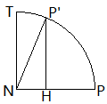

## 绕任意轴旋转  

设  
单位模四元数 $Q = \lbrack \, \cos{\frac{\theta}{2}} \; \sin{\frac{\theta}{2}} \; \overrightarrow{N} \, \rbrack$ //$\overrightarrow{N}$是单位向量    
$Q^{-1} = \lbrack \, \cos{\frac{\theta}{2}} \; \text{-}\sin{\frac{\theta}{2}} \; \overrightarrow{N} \, \rbrack$  
纯四元数 $P = \lbrack \, 0 \: \overrightarrow{P} \, \rbrack$ //三维空间内点  

几何意义  

//参考文献 (1.\[Vince 2011\]/6.6.2 Vectors| 2.[Pharr 2016]/2.7.6 Rotation around an Arbitrary Axis)  

//DirectXMath.h -> DirectX::XMMatrixRotationAxis  
//NormalAxis = Vector3Normalize(Axis) 

以下是垂直于NormalAxis的俯视图 //NormalAxis即$\overrightarrow{N}$  
  
  
设$\overrightarrow{ON}$是$\overrightarrow{OP}$在$\overrightarrow{N}$上的投影  
由于P绕NormalAxia旋转得到P‘ 显然$\overrightarrow{ON}$也是$\overrightarrow{OP'}$在NormalAxis上的投影  
  
显然有  
$\overrightarrow{OP} = \overrightarrow{ON} + \overrightarrow{NP}$  
$\overrightarrow{OP'} = \overrightarrow{ON} + \overrightarrow{NP'}$  
  
根据向量投影  
$\overrightarrow{ON} = \overrightarrow{N} \cdot \operatorname{dot} \lparen \overrightarrow{N} , \overrightarrow{P} \rparen$  
$\overrightarrow{NP} = \overrightarrow{OP} - \overrightarrow{ON} =  \overrightarrow{P} -  \overrightarrow{N} \cdot \operatorname{dot} \lparen \overrightarrow{N} , \overrightarrow{P} \rparen$ //$\overrightarrow{OP}$即$\overrightarrow{P}$  
  
根据叉乘的定义  
//大小 由于 $|\overrightarrow{N}|=1$且$\overrightarrow{N} \perp NP$ 因此 $| \operatorname{cross} \lparen \overrightarrow{N} , \overrightarrow{P} \rparen |$ = △ONP的面积的2倍 = $|\overrightarrow{N}| \cdot |\overrightarrow{NP}|$ = $| \overrightarrow{NP} |$ = $| \overrightarrow{NT} |$  
//方向 由于 NT$\perp$NP且NT$\perp$$\overrightarrow{N}$ => NT$\perp$平面ONP 因此 $\operatorname{cross} \lparen \overrightarrow{N} , \overrightarrow{P} \rparen$的方向与NT相同  
NT = $\operatorname{cross} \lparen \overrightarrow{N} , \overrightarrow{P} \rparen$ //右手系  
  
显然 //向量数乘的定义  
$\overrightarrow{NH} = \overrightarrow{NP} \cdot \cos\theta$  
= $\lparen \overrightarrow{P} -  \overrightarrow{N} \cdot \operatorname{dot} \lparen \overrightarrow{N} , \overrightarrow{P} \rparen \rparen \cdot \cos\theta$ //上式代入  
$\overrightarrow{HP'} = \overrightarrow{NT} \cdot \sin\theta$   
= $\operatorname{cross} \lparen \overrightarrow{N} , \overrightarrow{P} \rparen \cdot \sin\theta$ //上式代入  
  
$\overrightarrow{OP'} = \overrightarrow{ON} + \overrightarrow{NP'} = \overrightarrow{ON} + \overrightarrow{NH} + \overrightarrow{HP'}$  
= $\overrightarrow{N} \cdot \operatorname{dot} \lparen \overrightarrow{N} , \overrightarrow{P} \rparen + \lparen \overrightarrow{P} -  \overrightarrow{N} \cdot \operatorname{dot} \lparen \overrightarrow{N} , \overrightarrow{P} \rparen \rparen \cdot \cos\theta + \operatorname{cross} \lparen \overrightarrow{N} , \overrightarrow{P} \rparen \cdot \sin\theta$      
    
## 参考文献  
[1.\[Vince 2011\] John Vince. "Quaternions for Computer Graphics." Springer 2011.](http://www.johnvince.co.uk)  
[2.\[Pharr 2016\] Matt Pharr, Wenzel Jakob, Greg Humphreys. "Physically based rendering: From theory to implementation." Morgan Kaufmann 2016.](http://www.pbr-book.org)  

