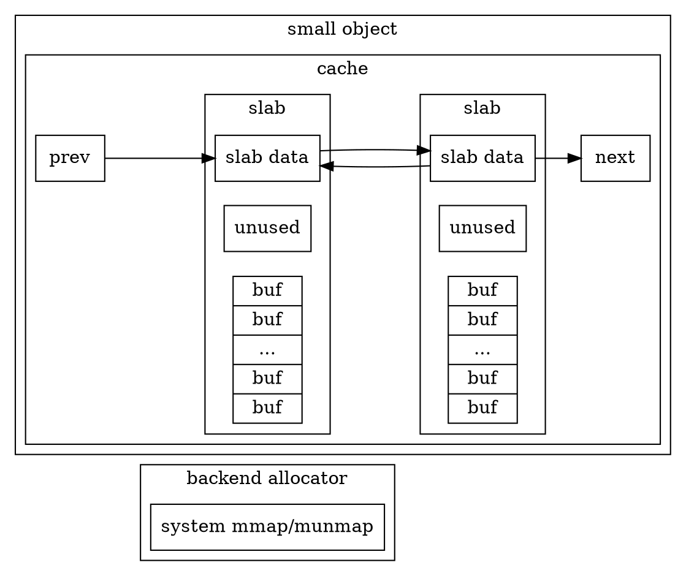

### Slab分配器（Slab Allocator）  
   
#### Slab的命名   
   
根据 \[Bonwick 1994\] / 3. Slab Allocator Implementation 中的说法，Slab的命名源于SunOS中的源代码——起初，在编写SunOS的源代码时，仅仅是出于“Slab”相对于“Object”或“Cache”而言更具有区分度，才作此命名——并无特别的含义。

#### 分离存储（Segregated-Storage）   
   
根据 \[Bonwick 1994\] / 4.4. Arena Management 中的说法，分配器（Allocator）对区域（Arena）的管理策略可以大致分为三类：顺序适配（Sequential-Fit）、伙伴（Buddy）和分离存储（Segregated-Storage）。 // 注：根据 Wikipedia / Region-based memory management 中的说明，此处的Arena与Region同义，译为“区域”再合适不过。  

显然，Slab分配器属于分离存储。在 \[Bonwick 1994\] / 3. Slab Allocator Implementation 和 \[Bonwick 1994\] / 4. Hardware Cache Effects 中对Slab分配器进行了详尽的介绍。接下来，本文也打算对Slab分配器进行介绍。为了方便读者参阅国际上的文献资料，同时为了提高辨识度，本文保留了表示Slab分配器中的数据结构的英文术语Cache、Slab和Buffer，而不译作中文。

所有Slab的大小都相同，被设定为一个页（Page）的大小。在POSIX系统上，一个页的大小可以用sysconf(_SC_PAGESIZE)查询。  

一个Slab中含有若干个Buffer，同一Slab中的Buffer的大小都相同，Slab的控制信息（Slab Data）被置于Slab的结束位置。 // 注：根据 \[Bonwick 1994\] / 3.2.2. Slab Layout for Small Objects 中的说法，经验表明，当应用程序尝试非法地修改已经被释放的内存时，Slab开始位置的数据被修改的可能性更高，将Slab的控制信息置于结束位置，可以减少Slab的控制信息被错误修改的可能性，更有利于调试。然而，经验性的法则多不可靠，读者大可不必理会。当下主流的TBB-Malloc（\[Kukanov 2007\]）就将Slab的控制信息置于开始位置。    

A slab consists of one or more pages of virtually contiguous memory carved up into **equal-size** chunks, with a reference count indicating how many of those chunks have been allocated. (\[Bonwick 1994\])

一个Cache中含有若干个Slab，同一Cache中的Slab中的Buffer的大小都相同。同一Cache中的Slab的控制信息构成双向循环链表，并保证Cache中的表头指针指向的Slab以及其之后（Next）的Slab都含有至少一个空闲的Buffer。

所谓的分离存储是指，

在分配内存时，

在释放内存时，Slab分配器需要借助哈希表来区分被释放的地址是Buffer还是Large Object。      

显然，Slab分配器的解决方案过于低效，让人很难接受。实际上，我们可以将Slab的控制信息置于开始位置，从而确保了Slab中的Buffer一定不会对齐到页大小。然而，由于Large Object的内存直接向系统申请，Large Object一定对齐到页大小。因此，在释放内存时，我们可以根据被释放的地址是否对齐对页大小来区分Buffer和Large Object，避免了借助哈希表进行映射的过程，这也是TBB-Malloc的做法（\[Kukanov 2007\]）。

### McRT-Malloc  

显然，McRT-Malloc也属于分离存储，McRT-Malloc中的各数据结构与Slab分配器之间的关系如下：     

McRT-Malloc | Slab Allocator   
:-: | :-:   
Bin | Cache  
Block | Slab  
Object | Buffer  

1\.\[Bonwick 1994\] [Jeff Bonwick. "The Slab Allocator: An Object-Caching Kernel Memory Allocator." USENIX 1994](https://www.usenix.org/legacy/publications/library/proceedings/bos94/bonwick.html)  

2\.\[Hudson 2006\] Richard L. Hudson, Bratin Saha, Ali-Reza Adl-Tabatabai, Benjamin C. Hertzberg. "McRT-Malloc: a scalable transactional memory allocator". ISMM 2006.   

3\.\[Kukanov 2007\] Alexey Kukanov, Michael J.Voss. "The Foundations for Scalable Multi-core Software in Intel Threading Building Blocks." Intel Technology Journal, Volume11, Issue 4 2007.  