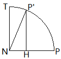

# 场景树（SceneTree）  
  
## 变换（Transform）  
  
### 矩阵（Matrix)  
  
#### 顶点变换 \ 切线变换 \ 法线变换  

引入矩阵的目的 充分利用 现代处理器 支持的 向量指令 进行加速 //SIMT   

仅从数学的角度 计算机图形学涉及到所有的计算都可以在不借助矩阵的情况下完成   
  
##### 法线变换  
//（1.\[Moller 2018\]/4.1.7 Normal Transform）  
//（2.\[Pharr 2016\]/2.8.3 Normals）  
  
###### 手性（Handedness）  

//根据（2.\[Pharr 2016\]/2.8.3 Normals）中的证明，$n'={\lparen M^{\text{-}1} \rparen}^T n$并不是唯一解，$n'= \lparen \text{-} {\lparen M^{\text{-}1} \rparen}^T \rparen n$也满足$n' \cdot t' = 0$，法线变换的矩阵是${\lparen M^{\text{-}1} \rparen}^T$还是$\text{-} {\lparen M^{\text{-}1} \rparen}^T$取决于M是否改变手性  
  
//（2.\[Pharr 2016\]/2.8.7 Transformations and Coordinate System Handedness）  
  
//（2.\[Pharr 2016\]/2.10.1 Surface Interaction）    
  

#### 平移（Translation) \ 旋转（Rotation） \ 缩放(Scaling) \ 分解（Decomposition）  

##### 平移
  
//根据运算规则，平移对 切线变换\法线变换 是没有意义的
  
##### 分解
//本节较难，可以暂时跳过
//需要先学习后文中的"任意旋转变换能用一个单位四元数表示"  
  
//DirectXMath -> DirectX::XMMatrixDecompose  
  
TRS是目前场景图（Scene Graph）中常用的顺序（1.\[Moller 2018\]/4.1.5 Concatenation of Transforms）  
  
  
//参考文献 (2.\[Pharr 2016\]/2.9.3 AnimatedTransform Implementation| 1.\[Moller 2018\]/4.2.3 Matrix Decomposition)  
  
//Polar Decomposition

#### 基变换  
  
##### 视野空间（View Space）  
  
//视野变换（View Transform）考虑平移，但平移对 切线变换\法线变换 是没有意义的  
//因此，视野变换针对坐标变换  
  
##### 切线空间（Tangent Space）  
  
//一般针对法线变换  
  
#### 投影（Projection）变换  
  
##### 正交投影（Orthographic Projection）   
  
##### 透视投影（Perspective Projection）        
  
##### 双抛物面投影（Dual Paraboloid Projection）   
  
### 四元数（Quaternion）  
  
#### 任意单位四元数都对应于一个旋转变换  
  
设  
单位模四元数 $Q = \lbrack \, \cos{\frac{\theta}{2}} \; \sin{\frac{\theta}{2}} \; \overrightarrow{N} \, \rbrack$ //$\overrightarrow{N}$是单位向量    
$Q^{-1} = \lbrack \, \cos{\frac{\theta}{2}} \; \text{-}\sin{\frac{\theta}{2}} \; \overrightarrow{N} \, \rbrack$  
纯四元数 $P = \lbrack \, 0 \: \overrightarrow{P} \, \rbrack$ //三维空间内点  

##### 几何意义  

//参考文献 (2.\[Pharr 2016\]/2.7.6 Rotation around an Arbitrary Axis| 3.\[Vince 2011\]/6.6.2 Vectors| 4.\[Vince 2012\]/6.10.2 Vectors)  

//DirectXMath -> DirectX::XMMatrixRotationAxis  
//NormalAxis = Vector3Normalize(Axis) 

以下是垂直于NormalAxis的俯视图 //NormalAxis即$\overrightarrow{N}$  
  
  
设$\overrightarrow{ON}$是$\overrightarrow{OP}$在NormalAxis上的投影 //$\overrightarrow{OP}$即$\overrightarrow{P}$  
由于P绕NormalAxis旋转得到P‘ 显然$\overrightarrow{ON}$也是$\overrightarrow{OP'}$在NormalAxis上的投影  
  
显然有  
$\overrightarrow{OP} = \overrightarrow{ON} + \overrightarrow{NP}$  
$\overrightarrow{OP'} = \overrightarrow{ON} + \overrightarrow{NP'}$  
  
根据向量投影  
$\overrightarrow{ON} = \overrightarrow{N} \cdot \operatorname{dot} \lparen \overrightarrow{N} , \overrightarrow{P} \rparen$  
$\overrightarrow{NP} = \overrightarrow{OP} - \overrightarrow{ON} =  \overrightarrow{P} -  \overrightarrow{N} \cdot \operatorname{dot} \lparen \overrightarrow{N} , \overrightarrow{P} \rparen$  
  
根据叉乘的定义  
//大小 由于 $\lvert \overrightarrow{N} \rvert=1$且$\overrightarrow{N} \perp NP$ 因此 $\lvert \operatorname{cross} \lparen \overrightarrow{N} , \overrightarrow{P} \rparen \rvert$ = △ONP的面积的2倍 = $\lvert \overrightarrow{N} \rvert \cdot \lvert \overrightarrow{NP} \rvert$ = $\lvert \overrightarrow{NP} \rvert$ = $\lvert \overrightarrow{NT} \rvert$  
//方向 由于 NT$\perp$NP且NT$\perp$$\overrightarrow{N}$ => NT$\perp$平面ONP 因此 $\operatorname{cross} \lparen \overrightarrow{N} , \overrightarrow{P} \rparen$的方向与NT相同  
NT = $\operatorname{cross} \lparen \overrightarrow{N} , \overrightarrow{P} \rparen$ //右手系  
  
显然 //向量数乘的定义  
$\overrightarrow{NH} = \overrightarrow{NP} \cdot \cos\theta$  
= $\lparen \overrightarrow{P} -  \overrightarrow{N} \cdot \operatorname{dot} \lparen \overrightarrow{N} , \overrightarrow{P} \rparen \rparen \cdot \cos\theta$ //上式代入  
$\overrightarrow{HP'} = \overrightarrow{NT} \cdot \sin\theta$   
= $\operatorname{cross} \lparen \overrightarrow{N} , \overrightarrow{P} \rparen \cdot \sin\theta$ //上式代入  
  
$\overrightarrow{OP'} = \overrightarrow{ON} + \overrightarrow{NP'} = \overrightarrow{ON} + \overrightarrow{NH} + \overrightarrow{HP'}$  
= $\overrightarrow{N} \cdot \operatorname{dot} \lparen \overrightarrow{N} , \overrightarrow{P} \rparen + \lparen \overrightarrow{P} -  \overrightarrow{N} \cdot \operatorname{dot} \lparen \overrightarrow{N} , \overrightarrow{P} \rparen \rparen \cdot \cos\theta + \operatorname{cross} \lparen \overrightarrow{N} , \overrightarrow{P} \rparen \cdot \sin\theta$  
  
#### 任意旋转变换都能用一个单位四元数表示  
  
  
### 对偶四元数（Dual Quaternion）  
  

### 
Object Instancing //2.\[Pharr 2016\]/4.1.2 TransformedPrimitive: Object Instancing and Animated Primitives  

## 参考文献  
[1.\[Moller 2018\] Tomas Akenine Moller, Eric Haines, Naty Hoffman, Angelo Pesce, Michal Iwanicki, Sebastien Hillaire. "Real-Time Rendering, Fourth Edition." A K Peters 2018.](http://www.realtimerendering.com)  
[2.\[Pharr 2016\] Matt Pharr, Wenzel Jakob, Greg Humphreys. "Physically based rendering: From theory to implementation, Third Edition." Morgan Kaufmann 2016.](http://www.pbr-book.org)  
[3.\[Vince 2011\] John Vince. "Quaternions for Computer Graphics." Springer 2011.](http://www.johnvince.co.uk)  
[4.\[Vince 2012\] John Vince. "Matrix Transforms for Computer Games and Animation." Springer 2012.](http://www.johnvince.co.uk)  

\[Arvo 1990\] James Arvo. "Transforming Axis-Aligned Bounding Boxes." Graphics Gems X.8 1990.

