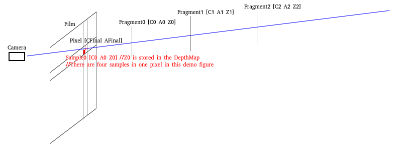

## License  
```  
Copyright (C) 2018-2020 YuqiaoZhang

This program is free software: you can redistribute it and/or modify it under the terms of the GNU Lesser General Public License as published by the Free Software Foundation, either version 3 of the License, or (at your option) any later version.

This program is distributed in the hope that it will be useful, but WITHOUT ANY WARRANTY; without even the implied warranty of MERCHANTABILITY or FITNESS FOR A PARTICULAR PURPOSE.  See the GNU Lesser General Public License for more details.

You should have received a copy of the GNU Lesser General Public License along with this program.  If not, see <https://www.gnu.org/licenses/>
```  
  
## Alpha Channel  
Porter proposed "Alpha channel"(1.[Porter 1984]) in 1984 which is widely established in real-time rendering to simulate the transparent effect.  

We assume that one "pixel" corresponds to a series of "fragments" which can be treated as the triples \[ $C_i$ $A_i$ $Z_i$ \] (C-Color A-Alpha Z-Depth), as shown in the following figure:  
  
Then the final color of the pixel can be calculated as $\displaystyle C_{\displaystyle Final} = \sum_{\displaystyle i = 0}^{\displaystyle n} (\prod_{\displaystyle Z_j Nearer Z_i}(1 - A_j) A_i C_i)$.  

The $\displaystyle \operatorname{V} ( Z_i ) = \prod_{\displaystyle Z_j Nearer Z_i} 1 - A_j$ is also called the visibility function which will be explained later.  
Then the above equation can also be written as $\displaystyle C_{\displaystyle Final} = \sum_{\displaystyle i = 0}^{\displaystyle n} \operatorname{V} ( Z_i ) A_i C_i$.    

Note that the physical meaning of the Alpha is the "partial coverage" rather than the "transmittance".  

The Alpha stands for the ratio of the area covered by the fragments to the area covered by the pixel. That's why we use the scalar "float" instead of the vector "RGB" to represent the Alpha. This circumstance is also called the "Wavelength Independent" in some literatures.  
For example, when we observe a red brick through a blue silk scarf, the color of the brick appears to be the "addition" of the blue and red. The fibers of silk scarf are intrinsically opaque but there exist gaps between the fibers. We see the brick through the gaps. Namely, the silk scarf "partially covers" the brick.

However, the transmittance is "Wavelengh Dependent". If we observe a red brick through a blue plastic film, the color of the brick appears to be black (the "Multiplication" of the blue and red). The red brick only reflects the red light while the blue plastic film only allows blue light to pass through. All the reflected light of the red brick is absorbed by the blue plastic film and then the red brick appears to be black.  

You can do the above two experiments by yourself.  

If we demand the transmittance effect, the techniques related to the "Participating Media"(2.[Yusor 2013]、3.[Hoobler 2016]) should be used.  

By the physical meaning of the Alpha, we can comprehend the visibility function $\displaystyle \operatorname{V} ( Z_i )$ evidently since a fragment can only be (partially) covered by the fragments nearer than it.  
Some literatures treat the visibility function $\displaystyle \operatorname{V} ( Z_i )$ as the "transmittance". Technically, that's wrong. 

## Ordered Transparency  
In real time rendering, the classic method is to sort the transparent geometries and use the "Over/Under Operation"(1\.[Porter 1984]、4\. [Dunn 2014]) to calculate the final color $C_{Final}$ recursively:  
> 1\.OpaquePass  
draw the opaque geometries and have the BackgroundColor and the BackgroundDepth.  
  
> 2\.TransparencyPass  
use the BackgroundDepth for depth test (without depth write), sort the geometries from back to front/from front to back and use Over/Under Operation to calculate recursively.  
>  
> Over Operation  
sort the fragments from back to front to use the Over Operation  
$C_{Final\_0}=BackgroundColor$  
$C_{Final\_n}=(A_nC_n)+(1-A_n) C_{Final\_n-1}$  
>  
> Under Operation  
sort the fragments from front to back to use the Under Operation  
$C_{Final\_0}=0$  
$A_{Total\_0}=1$  
$C_{Final\_n}=A_{Total\_n-1}( A_nC_n)+C_{Final\_n-1}$  
$A_{Total\_n}=A_{Total\_n-1}( 1-A_n)$   
Note that the $A_{Total}$ in Under Operation is exactly the visibility function $\operatorname{V} ( Z_i )$ above.   
At last, the result image of the OpaquePass is treated as the fragments with "A=1 C=BackgroundColor" and added to the final color by the Under Operation.
  
By the mathematical induction, we can prove that the Over Operation and the Under Operation are equivalent. Both can calculate the final color $C_{Final}$ correctly by $\displaystyle \sum_{\displaystyle i = 0}^{\displaystyle n} \operatorname{V} ( Z_i ) A_i C_i$.  

Technically, the correctness of the Over/Under Operation can only be guaranteed by sorting the "fragments" from back to front/from front to back. However, in real time rendering, the sorting is based on the geometries not the fragments. If there exists interlacing inside the geometry, the order of the fragments will not follow and thus we have to explore the OIT(Order Independent Transparency) algorithm to settle this problem.

Note that keeping the geometries orderly also prohibits the batching of the geometries with the same material and thus results in extra state changing which is hostile to the performance.
  
## Depth Peeling  
Depth Peeling(5.[Everitt 2001]) is an archaic method which might be used in real time rendering.  
  
### Render Pass  
>1\.OpaquePass  
draw opaque geometries and have the BackgroundColor and the BackgroundDepth.  

>2\.NearestLayerPass //GeometryPass  
copy the BackgroundDepth to initialize the depth buffer  
with depth test(NearerOrEqual) and depth write, sort the transparent geometries by \[material, front-to-back\] and draw them, having the NearestLayerColor and the NearestLayerDepth  
add the NearestLayerDepth to the final color $C_{Final}$ by Under Operation  
//Note that the depth peeling doesn't depend on the order of the fragments and we sort the geometries from front to back is merely to improve the performance by the EarlyDepthTest.

>3\.SecondNearestLayerPass //GeometryPass
copy the BackgroundDepth to initialize the depth buffer  
with depth test(NearerOrEqual) and depth write, sort the transparent geometries by \[material, front-to-back\], bind the NearestLayerDepth to the SampledTextureUnit and draw them with discarding the fragments NearerOrEqual than the NearestLayerDepth explicitly in the fragment shader, having the SecondNearestLayerColor and the SecondNearestLayerDepth  
add the SecondNearestLayerColor to the final color $C_{Final}$ by Under Operation  
//Note that the depth peeling doesn't depend on the order of the fragments and we sort the geometries from front to back is merely to improve the performance by the EarlyDepthTest.

>4\.ThirdNearestLayerPass //GeometryPass
copy the BackgroundDepth to initialize the depth buffer  
with depth test(NearerOrEqual) and depth write, sort the transparent geometries by \[material, front-to-back\], bind the SecondNearestLayerDepth to the SampledTextureUnit and ...  
//Note that the depth peeling doesn't depend on the order of the fragments and we sort the geometries from front to back is merely to improve the performance by the EarlyDepthTest.

>The subsequent operations are similar to the above, omitted... //we can peel N layers by N geometry passes. The application can choose the proper N according to the requirements.

>N+2\.CompositePass //FullScreenTrianglePass  
At last, the BackgroundColor by OpaquePass is added to the final color by the Under Operation.  

Technically, it's legal to peel the layers from far to near and add them to the final color by the Over Operation.  
However, if the number of the geometry passes N is too low to peel all layers, the farthest/nearest layers will be ignored when we use the Under/Over Operation.  
Evidently, the visibility function $\displaystyle \operatorname{V} ( Z_i )$ is monotonically decreasing. It follows that the farthest layers generally contribute little to the final color and introduce little error if they are ignored. That's why we prefer the Under Operation to the Over Operation.
  
### Conclusion  
Evidently, the depth peeling has a fatal disadvantage that the number of the geometry passes is too high and the performance is too low and thus the depth peeling has never been popular since proposed decades ago.  

## Stochastic Transparency  
The estimation of the visibility function $\displaystyle \operatorname{V} ( Z_i )$ depends on the order of the fragments. This results in that the estimation of the final color $\displaystyle C_{\displaystyle Final} = \sum_{\displaystyle i = 0}^{\displaystyle n} \operatorname{V} ( Z_i ) A_i C_i$ depends on the order.  
By this fact, Enderton proposed "stochastic transparency"(6.[Enderton 2010]) in 2010 which is based on the the principles of statistics and uses MSAA hardware to random sampling to estimate the visibility function $\operatorname{V} ( Z_i )$ order independently.  

### Stochastic Depth  
With the MSAA on, we assume the relationship among the "pixel", "fragment" and "sample" as the following figure:  
  
one pixel corresponds to several samples (for example, in the above figure, one pixel corresponds to 4 samples, namely, 4X MSAA) and at the same time one pixel corresponds to a series of fragments.  
However, the same sample corresponding to the same pixel can only be occupied by one fragment of these fragments corresponding to the same pixel(The storage is limited, which can hold only one fragment. That's evident).  

At the same time, we assume that:  
$Z_j$ denotes one fragment of the fragments$Z_0$ $Z_1$ $Z_2$ ... $Z_n$ corresponding to the same pixel.  
$Z_s$ denotes the fragment which occupies the sample in the final result depth image(the StochasticDepth in the implement). As we have explained above, by the limit of the storage, the sample can only be occupied by one fragment.  
$Z_i$ denotes the fragment which is being discussed(which can be considered as the fragment being executed by the fragment shader in the implement).

In addition, we assume that:  
By setting the value of gl_SampleMask/SV_Coverage, we ensure that the probability of each sample be occupied by the fragment \[ $C_i$ $A_i$ $Z_i$ \] is $A_i$.  
With depth test and depth write, we ensure that the nearer fragment must overwrite the farther fragment and the sample is occupied by the nearest fragment.  
The probabilities of different fragments are uncorrelated.  

We claim that for each sample \[ $C_s$ $A_s$ $Z_s$ \] in the final result depth image, for each fragment \[ $C_i$ $A_i$ $Z_i$ \] among the fragments corresponding to the same pixel, the probability of "$Z_i$ is Near-or-Equal than $Z_s$" is exactly the visibility function $\displaystyle \operatorname{V} ( Z_i ) = \prod_{\displaystyle Z_j Nearer Z_i} 1 - A_j$.  

Proof:  
Since "the nearer fragment must overwrite the farther fragment", if "$Z_i$ is Near-or-Equal than $Z_s$", then we have that the sample in the final result depth image is occupied by \[ $C_i$ $A_i$ $Z_i$ \] or the farther fragments corresponding to the same pixel.  
Namely, the sample is not be occupied by the nearer fragments corresponding to the same pixel.  
Evidently, the probability of "the sample is not be occupied by one fragment $Z_j$ among these nearer fragments" is $1 - A_j$.  
Since "the probabilities of different fragments are uncorrelated", by the multiplication principle, the probability of "the sample is not be occupied by the nearer fragments corresponding to the same pixel" is $\displaystyle \prod_{\displaystyle Z_j Nearer Z_i} 1 - A_j$ which is exactly the visibility function $\displaystyle \operatorname{V} ( Z_i )$.  

Besides, we assume that:  
One pixel corresponds to S samples, namely, S-X MSAA.  

We claim that if the count of the samples such that "$Z_i$ is Near-or-Equal than $Z_s$" is $\operatorname{Count} ( Z_i )$, let $\displaystyle \operatorname{SV}( Z_i ) = \frac{ \operatorname{Count} ( Z_i ) }{S}$, we have that the expected value of the $\displaystyle \operatorname{SV}( Z_i )$ is the visibility function $\displaystyle \operatorname{V} ( Z_i )$.  

Proof:
Evidently, this is immediate from the above proposition.  

Since we can get the value of $\operatorname{Count} ( Z_i )$ by sampling texture, we can use $\displaystyle \operatorname{SV}( Z_i )$ to estimate the visibility function $\displaystyle \operatorname{V} ( Z_i )$.  
Note that the extension "ARB_texture_multisample" should be enabled to use texelFetch on sampler2DMS in OpenGL.  
We should use the knowledge of statistics to prove why we can estimate and thus the proof is omitted. 

### Alpha Correction  

We claim that ${\displaystyle{\sum_{i = 0}^n}} ( \operatorname{V} ( Z_i ) A_i ) = 1 - {\displaystyle{\prod_{i = 0}^n}} ( 1 - A_i )$.  

Proof:  
Prove by the mathematical induction.  
1\.basis:  
when n=0:  
left = ${\displaystyle{\sum_{i = 0}^0}} ( \operatorname{V} ( Z_i ) A_i )$  
= $\operatorname{V} ( Z_0 ) A_0$  
= $1 \cdot A_0$  
= $A_0$  
right = $1 - {\displaystyle{\prod_{i = 0}^0}} ( 1 - A_i )$  
= $1 - ( 1 - A_0 )$  
= $A_0$  
left = right the equation holds  
2\.inductive step:  
we assume that the proposition holds for n=k.  
when n=k+1:  
left = ${\displaystyle{\sum_{i = 0}^{k + 1}}} ( \operatorname{V} ( Z_i ) A_i )$  
= ${\displaystyle{\sum_{i = 0}^k}} ( \operatorname{V} ( Z_i ) A_i ) + \operatorname{V} ( Z_{k+1} ) A_{k+1}$  
= $1 - {\displaystyle{\prod_{i = 0}^k}} ( 1 - A_i ) + \operatorname{V} ( Z_{k+1} ) A_{k+1}$  
= $1 - {\displaystyle{\prod_{i = 0}^k}} ( 1 - A_i ) + ( {\displaystyle{\prod_{i=0}^k}} ( 1 - A_i ) ) \cdot A_{k+1}$   
= $1 - ( {\displaystyle{\prod_{i = 0}^k}} ( 1 - A_i )) \cdot ( 1 - A_{k+1} )$  
= $1 - {\displaystyle{\prod_{i = 0}^{k + 1}}} ( 1 - A_i )$   
right = $1 - {\displaystyle{\prod_{i = 0}^{k + 1}}} ( 1 - A_i )$  
left = right the equation holds  

Evidently, the expected value of ${\displaystyle{\sum_{i = 0}^n}} ( \operatorname{SV} ( Z_i ) A_i )$ is ${\displaystyle{\sum_{i = 0}^n}} ( \operatorname{V} ( Z_i ) A_i )$.  
Since ${\displaystyle{\sum_{i = 0}^n}} ( \operatorname{V} ( Z_i ) A_i ) = 1 - {\displaystyle{\prod_{i = 0}^n}} ( 1 - A_i )$, we have that the expected value of ${\displaystyle{\sum_{i = 0}^n}} ( \operatorname{SV} ( Z_i ) A_i )$ is $1-\prod_i ( 1-A_i )$.  

The Alpha correction can be considered as the normalizing of the $\operatorname{SV} ( Z_i )$.  
This means that we assume that $\frac{\operatorname{SV} ( Z_i )}{ {\displaystyle{\sum_{i = 0}^n}} ( \operatorname{SV} ( Z_i ) A_i )} = \frac{\operatorname{V} ( Z_i )}{ {\displaystyle{\sum_{i = 0}^n}} ( \operatorname{V} ( Z_i ) A_i ) }$ and we have that ${\operatorname{V} ( Z_i )} = {\operatorname{SV} ( Z_i )}{\frac{ {\displaystyle{\sum_{i = 0}^n}} ( \operatorname{V} ( Z_i ) A_i ) }{ {\displaystyle{\sum_{i = 0}^n}} ( \operatorname{SV} ( Z_i ） A_i ）}} = { \operatorname{SV}( Z_i )}{\frac{1 - {\displaystyle{\prod_{i = 0}^n}} ( 1-A_i )}{ {\displaystyle{\sum_{i = 0}^n}} ( \operatorname{SV} ( Z_i ) A_i )}}$.  

We should use the knowledge of statistics to explain the meaning of the Alpha correction and thus the explanation is omitted.

### Render Pass  
> 1\.OpaquePass  
draw the opaque geometries and have the BackgroundColor and the BackgroundDepth.

> 2\.StochasticDepthPass //GeometryPass  
copy the BackgroundDepth to initialize the depth buffer  
with MSAA, with depth test(NearerOrEqual) and depth write, sort the transparent geometries by \[material, front-to-back\] and draw them with setting the pseudo random value of gl_SampleMask/SV_Coverage by the $A_i$ of \[ $C_i$ $A_i$ $Z_i$ \], having the StochasticDepth  
Note that:  
2-1\.The stochastic transparency doesn't depend on the order of the fragments and we sort the geometries from front to back is merely to improve the performance by the EarlyDepthTest.  
2-2\.Turning on MSAA in StochasticDepthPass is to random sample and the stochastic transparency intrinsically doesn't demand other passes to turn on the MSAA.  
If the application demands the effect of "Spatial AntiAliasing", the application can turn on MASS in other passes(Evidently, the application use arbitrary algorithms(for example, the FAXX) in other passes).  
These's no relationship between the MSAA used for random sampling (in StochasticDepthPass) and the MSAA used for spatial antialiasing (in other passes). For example, we can use 8X MASS in StochasticDepthPass while use 4X MSAA in other passes.  
2-3\.To ensure the uncorrelation among fragments, we must use pseudo random value rather than the "AlphaToCoverage" hardware feature.  
2-4\.The depth value used in AccumulatePass is the value of the shading position not the value of the sampling position. To be consistant, we prefer to write the depth (value of the shading position) to gl_FragDepth/SV_Depth in the fragment shader.  
2-5\.By the limit of the hardware, the maximum sample count of MSAA is 8X MSAA. The author (6.[Enderton 2010]) proposed that we can use multiple passes to simulate more sample counts. Due to the performance issue, we only use one pass.  

> 3\.AccumulateAndTotalAlphaPass //GeometryPass  
copy the BackgroundDepth to initialize the depth buffer  
with depth test without depth write, with MRT and SeparateBlend/IndependentBlend, sort the transparent geometries by \[material\], bind the StochasticDepth to the SampledTextureUnit and draw them with estimate $\operatorname{SV} ( Z_i )$ by sampling the texture in fragment shader, having the StochasticColor, CorrectAlphaTotal and StochasticTotalAlpha  
Note that:  
3-1\.Since the depth write is turned off, the order of the geometries doesn't impact on the performance and thus we sort the geometries only by the material.  
3-2\.We have that "StochasticColor = ${\displaystyle\sum_{i = 0}^n} \operatorname{SV} ( Z_i )  A_i C_i$", "CorrectAlphaTotal = $1 - {\displaystyle\prod_{i = 0}^n} ( 1 - A_i )$" and "StochasticTotalAlpha = ${\displaystyle\sum_{i = 0}^n} ( \operatorname{SV} ( Z_i ) A_i )$".  
3-3\.The relationship between the AlphaTotal and the TotalAlpha is TotalAlpha = 1 – AlphaTotal. The term "TotalAlpha" is from the stochastic transparency(6.[Enderton 2010]) while the term "AlphaTotal" is from the Under Operation(1.[Porter 1984]、4. [Dunn 2014]).  
3-4\.The StochasticTotalAlpha is only used when the Alpha correction is turned on. This means that we can reduce one RT if we don't turn on the Alpha correction.  
3-5\.The author(6.[Enderton 2010]) use two separate passes AccumulatePass(which calculates the StochasticColor and the StochasticTotalAlpha) and TotalAlphaPass(which calculates CorrectAlphaTotal). However, we can totally merge them into a single pass. Maybe the SeparateBlend/IndependentBlend was not supported by the hardware when the author published the paper.

>4\.CompositePass //FullScreenTrianglePass  
Without the Alpha correction, the total contribution of the transparent geometries:  
TransparentColor = $\displaystyle { \sum_{i = 0}^n} \operatorname{SV} ( Z_i )  A_i C_i$ = StochasticColor  
With the Alpha correction, the total contribution of the transparent geometries:  
TransparentColor = ${\begin{cases} {\displaystyle\sum_{i = 0}^n} {  ( \operatorname{SV} ( Z_i ) \frac{1- {\displaystyle\prod_{i = 0}^n} ( 1 - A_i ) }{ {\displaystyle\sum_{i = 0}^n} ( \operatorname{SV}( Z_i ) A_i )} ) A_i C_i  } &{if \; {\displaystyle\sum_{i = 0}^n} {\operatorname{SV}( Z_i ) A_i)} > 0} \\0 &{if \; {\displaystyle\sum_{i = 0}^n} \operatorname{SV}( Z_i ) A_i = 0} \end{cases}}$   
= ${\begin{cases} {({\displaystyle\sum_{i = 0}^n}{\operatorname{SV}( Z_i )} A_i C_i)}{\frac{1 - {\displaystyle\prod_{i = 0}^n}( 1 - A_i )}{{\displaystyle\sum_{i = 0}^n}(\operatorname{SV}( Z_i ) A_i)}} &{if\;{\displaystyle\sum_{i = 0}^n} ( \operatorname{SV}( Z_i ) A_i ) > 0} \\0 &{if\;{\displaystyle\sum_{i = 0}^n}{({\operatorname{SV}( Z_i)}A_i)}=0} \end{cases}}$  
= ${\begin{cases} \text{StochasticColor} \frac{ 1 - \text{CorrectAlphaTotal}}{\text{StochasticTotalAlpha}} &{if\;{\displaystyle\sum_{i = 0}^n}{({\operatorname{SV}( Z_i )}A_i)} > 0} \\0 &{if\;{\displaystyle\sum_{i = 0}^n} ( \operatorname{SV}( Z_i ) A_i ) = 0} \end{cases}}$   
Note that the StochasticTotalAlpha of opaque geometries is evidently zero. However, due to the random sampling, the StochasticTotalAlpha of the transparent geometries can be zero as well.  

> Then, add the TransparentColor to the final color $\displaystyle C_{Final}$ by the Over Operation:  
$\displaystyle C_{Final}$ = TransparentColor + CorrectAlphaTotal × BackgroundColor)  
Note that the BackgroundColor has been added to the color buffer. We can output the TransparentColor and CorrectAlphaTotal in the fragment shader and use the Alpha blend hardware feature to implement the Over Operation.  

### Tile/On-Chip Memory  
The stochastic transparency is intrinsically suitable to mobile GPU.  

In the traditional desktop GPU, the performance bottleneck is the MSAA. Since one pixel corresponds to S samples, the bandwidth is increased by S times.  

However, in the mobile GPU, this problem has been solved effectively. We can keep the MSAA image in the Tile/On-Chip Memory and discard the MSAA image when the renderpass ends without writing to the main memory. This means that the bandwidth can be decreased to almost zero.  

The Vulkan/Metal API allows the application to set this configuration explicitly:  
Use the "VK_IMAGE_USAGE_TRANSIENT_ATTACHMENT_BIT"/"MTLStorageModeMemoryless" to set the storage mode of the image to the Tile/On-Chip Memory explicitly.  
And the images with this storage mode prohibit to be read by the traditional sampled texture unit in the fragment shader and must be read by the "Subpass Input"/"\[color(m)\]Attribute".

The OpenGL API doesn't allow the application to set this configuration explicitly but we can use "FrameBufferFetch"/"PixelLocalStorage"(16.[Bjorge 2014]) to indicate our purpose.  

#### Vulkan   

In Vulkan, one "RenderPass" consists of several "SubPass". The MSAA simple count of different attachments of the same RenderPass may not be the same. However, the MSAA sample count of the attachments refered by the same SubPass must be the same and the MSAA sample count is also expected to be the same as the count in MultisampleState of the PipelineState when issuing DrawCall.

The stochastic transparency can be implemented in one RenderPass as the following: //We suppose the application doesn't turn on the MSAA for "Spatial AntiAliasing".  
```
RenderPass  
    Attachments  
        0.FinalColor
        1.BackgroundDepth  
        2.StochasticDepth (MSAA)
        3.StochasticColor
        4.CorrectAlphaTotal
        5.StochasticTotalAlpha
    SubPasses
        0.OpaquePass
            ColorAttachments
                0.FinalColor //BackgroundColor->FinalColor
            DepthStencilAttachment
                1.BackgroundDepth
        1.CopyPass //Mentioned in StochasticDepthPass //Rasterization MSAA
            InputAttachments
                1.BackGroupDepth
            ColorAttachments
                2.StochasticDepth (MSAA)
        2.StochasticDepthPass //Rasterization MSAA
            DepthStencilAttachments
                2.StochasticDepth (MSAA)  
        3.AccumulateAndTotalAlphaPass
            InputAttachments
                2.StochasticDepth (MSAA)
            ColorAttachments
                3.StochasticColor
                4.CorrectAlphaTotal
                5.StochasticTotalAlpha
            DepthStencilAttachments
                1.BackGroupDepth
        4.CompositePass
            InputAttachments
                3.StochasticColor
                4.CorrectAlphaTotal
                5.StochasticTotalAlpha
            ColorAttachments
                0.FinalColor  //TransparentColor
                (+=(CorrectAlphaTotal×BackgroundColor))->FinalColor //implement the Over Operation by the Alpha blend hardware feature
    Dependency:
        0.SrcSubPass:0->DstSubPass:1
            //DepthStencilAttachment->InputAttachment: 1.BackGroupDepth
        1.SrcSubPass:1->DstSubPass:2
            //ColorAttachment->DepthStencilAttachment: 2.StochasticDepth (MSAA)
        2.SrcSubPass:2->DstSubPass:3
            //DepthStencilAttachment->InputAttachment: 2.StochasticDepth (MSAA)
        3.SrcSubPass:3->DstSubPass:4
            //ColorAttachment->ColorAttachment: 0.FinalColor
            //ColorAttachment->InputAttachment: 3.StochasticColor
            //ColorAttachment->InputAttachment: 4.CorrectAlphaTotal
            //ColorAttachment->InputAttachment: 5.StochasticTotalAlpha
    //SubPassDependencyChain: 0->1->2->3->4  
```
  
#### Metal  

In Metal, there is no such thing like InputAttachment. We instead use the \[color(m)\]Attribute in fragment shader to read the ColorAttachment.  
However, this design introduces the limit that the \[color(m)\]Attribute only permits us to read the ColorAttachment in the fragment shader and We have no method to read the DepthAttachment. We have to use an extra ColorAttachment to store the Depth(17\.\[Apple\]) although this may allow us to save the bandwidth by writing the lower precise depth to the ColorAttachment and discarding the DepthAttachment.
This limit may be related to the explanation of the "D3D12_RESOURCE_FLAG_DENY_SHADER_RESOURCE"(18\.\[Microsoft\]). This means that for Apple's GPU, the performance may be improved by prohibiting reading the DepthAttachment.

Besides, there is no equivalent of "subpassInputMS" in Metal. While turning on the MSAA in Metal, the fragment shader is excuted isolatedly for each sample, we can only use the \[color(m)\]Attribute to read the value of one sample not all samples in the pixel and thus we can calculate the $\operatorname{SV}( Z_i )$.  

However, we may simulate the "subpassInputMS" by multiple ColorAttachments without MSAA. Since we turn off the MSAA, there exists only one sample in the DepthAttachment and thus we can't perform MSAA depth test by the hardware feature. This means that we have to simulate the depth test by programmable blending which will be explained later in the K-Buffer.  

Evidently, the simulation is expected to be hostile to the performance and I don't suggest using this method in Metal.
  
### Conclusion  
Since MSAA is efficient on mobile GPU, the stochastic transparency is intrinsically suitable to mobile GPU. We can use the modern Vulkan API to fully explore the advantages of the mobile GPU.  

However, due to the limit by the design of the Metal, I don't suggest using the stochastic transparency in Metal.  

Evidently, the vertex shader doesn't read or write the ColorAttachment and thus doesn't benifit from the Tile/On-Chip Memory of the mobile GPU. The mobile GPU prefers the fragment processing to the vertex processing(10.[Harris 2019]).  
The stochastic transparency still need to be improved since we still have two geometry passes(StochasticDepthPass and AccumulateAndTotalAlphaPass) which may cause the vertex processing to be the performance bottleneck.  

The stochastic transparency introduces error by itself due to the random sampling while the Alpha correction eliminates the noise effectively and thus the noise impacts little. 
    
### Demo  

The github address[https://github.com/YuqiaoZhang/StochasticTransparency](https://github.com/YuqiaoZhang/StochasticTransparency)

The demo was originally the "StochasticTransparency" of the "NVIDIA SDK11 Samples"(9.[Bavoil 2011]). However, there are three fatal problems in the original code provide by the NVIDIA:  
1\."Turning on MSAA in StochasticDepthPass is to random sample and the stochastic transparency intrinsically doesn't demand other passes to turn on the MSAA." The original code provided by the NVIDIA turns on the MSAA in all passes and thus the frame rate of the stochastic transparency is unexpectedly lower than the depth peeling. I turn off all the unnecessary MSAA and the frame rate increases from 670 to 1170 while the frame rate of deep peeling is 1070.  
2\."The author use two separate passes AccumulatePass and TotalAlphaPass. However, we can totally merge them into a single pass." The original code provided by the NVIDIA follows the author and use two separate passes. I merge the separate passes and the frame rate increases from 1170 to 1370.  
3\."The depth value used in AccumulatePass is the value of the shading position not the value of the sampling position. To be consistant, we prefer to write the depth (value of the shading position) to gl_FragDepth/SV_Depth in the fragment shader." The original code provided by the NVIDIA doesn't do this. However, the Alpha correction fixes the error well and there's little impaction on the effect.  

## K-Buffer  
> 在Porter提出Alpha通道的同一年，Carpenter提出了A-Buffer：在A-Buffer中，每个像素对应于一个链表，存放对应到该像素的所有片元；基于深度对链表中的片元排序后，用Over/Under操作即可得到$C_{Final}$（11.[Carpenter 1984]）。虽然，目前的硬件在理论上已经可以通过UAV(Direct3D)和原子操作实现A-Buffer，但是，由于实现的过程极其繁琐（编程是一门艺术，A-Buffer的实现极不优雅）且效率低下（主要是链表的地址不连续导致缓存命中率下降），几乎不存在A-Buffer的实际应用。  
>
> 在2007年，Bavoil在A-Buffer的基础上进行了改进，将每个像素对应的片元个数限定为K个，提出了更具有实用价值的K-Buffer（12.[Bavoil 2007]）。  
  
### RMW操作  
> 在生成K-Buffer的Pass中，在每个片元生成时会进行以下RMW（Read Modify Write，读取-修改-写入）操作：  
> 1.Read：读取当前片元所对应的像素所对应的K个片元。  
> 2.Modify：结合当前片元，对读取得到的K个片元进行修改。 //在OIT算法中，一般是将当前片元插入到这K个片元中得到K+1个片元，并找出两个“最接近”的片元进行融合，再次得到K个片元  
> 3.Write：将修改后的K个片元写入当前片元所对应的像素。  
     
> 对目前的硬件而言，只要在片元着色器中访问StorageImage(OpenGL/Vulkan) / UAV(Direct3D)，就可以做到每个像素对应于K个片元并且在每个片元生成时对这K个片元进行RMW操作。但是，事情远远没有这么简单，一般而言，对应于同一像素的不同片元的RMW操作必须“**互斥**”才能保证最终结果的正确性。  
  
> 在API层面，对应于同一像素的不同片元之间的同步发生在Alpha融合阶段，也就是说，这些片元在片元着色器阶段是并行执行的。  
>   
> 在桌面GPU（Sort-Last Fragment）上，对应于同一像素的不同片元的RMW操作的“**竞态条件**（Race Condition）”显得尤其显著。  
> 不妨回忆，在顺序性透明中，我们将物体从前往后/从前往后排序，并依次调用Draw Call，这意味应用程序调用Draw Call的顺序隐含着某种依赖关系。但是，GPU的设计者往往希望尽可能地提升并行度以充分挖掘GPU的性能；在实际中，GPU仍并行地处理这些Draw Call，只不过会在某个同步点进行同步，使最终结果满足应用程序所期望的依赖关系。  
> 在桌面GPU上，这个同步点发生在片元着色器之后Alpha融合之前的Reorder Buffer中（13.[Ragan-Kelley 2011]），也就是说，即使在Draw Call顺序上存在着依赖关系的片元，在GPU中也是并行处理的（即存在**竞态条件**），更不用说在同一个Draw Call中（即在应用层不存在任何期望的依赖关系）的片元。  
>  
> 在移动GPU（Tile-Based Sort-Middle）上，由于没有Reorder Buffer的存在，对应于同一像素的不同片元是串行执行的（13.[Ragan-Kelley 2011]）。这也是移动GPU并不需要Depth PrePass（10.[Harris 2019]）的原因，GPU会在EarlyDepthTest阶段确定最终覆盖像素的片元，并只为该片元执行片元着色器；由于在大多数情况下（比如绘制不透明物体），最终覆盖像素的片元只有一个，串行执行并不会对性能有太大的影响。这也解释了移动GPU排斥Discard（10.[Harris 2019]）的原因，Discard会导致GPU无法在EarlyDepthTest阶段确定最终覆盖像素的片元，可能会导致GPU为对应于同一像素的多个片元执行片元着色器，然而在移动GPU上，这些片元着色器是串行执行的，在效率上低于桌面GPU（并行执行）。  
> 但是，由于片元着色器阶段在API层面被看作是并行执行的，而且GPU硬件的内部实现是不公开的，应用程序还是不应当作出“对应于同一像素的不同片元在访问StorageImage(OpenGL/Vulkan) / UAV(Direct3D)时的RMW操作不存在**竞态条件**”的假定。还是有很多其它潜在的因素可能会对此造成影响，比如：执行依赖并不代表内存依赖，由于StorageImage(OpenGL/Vulkan) / UAV(Direct3D)并不保存在Tile/On-Chip Memory中，考虑到缓存机制的存在，虽然，对应于同一像素的不同片元是串行执行的，但是，之前的片元对StorageImage(OpenGL/Vulkan) / UAV(Direct3D)的写入并不一定会对之后的片元可见（即之前的片元写入到了缓存，而之后的片元从主存中读取；至少在API层面完全允许GPU的设计者这么做）。 //个人认为还是有必要通过实验来确定    
  
> Bavoil在2007年提出K-Buffer时，同时提出了两种硬件上的设计——片元调度（Fragment Schedule）和可编程融合（Programmable Blending）——来解决对应于同一像素的不同片元的RMW操作存在**竞态条件**的问题（12.[Bavoil 2007]）。目前，这两种设计都已经在实际中被硬件广泛支持。  
  
### 片元调度（Fragment Scheduling）  
> 片元调度对应于目前的RasterOrderView(Direct3D) / FragmentShaderInterlock(OpenGL/Vulkan) / RasterOrderGroup(Metal)（14.[D 2015]、15.[D 2017]），往往适用于桌面GPU。  
>    
> 使用片元调度实现K-Buffer的片元着色器的代码大致如下：  
    
```  
        Do Shade //这部分代码并不需要互斥
                                                
    //Enter Critical Section //进入临界区
    #if RasterOrderView(Direct3D)
        Read From ROV
    #elif FragmentShaderInterlock(OpenGL/Vulkan)
        beginInvocationInterlockARB
    #elif RasterOrderGroup(Metal)
        Read From ROG
    #endif

        Do K-Buffer RMW //这部分代码处于临界区保护内

    //Leave Critical Section //离开临界区
    #if RasterOrderView(Direct3D)
        Write To ROV
    #elif FragmentShaderInterlock(OpenGL/Vulkan)
        endInvocationInterlockARB
    #elif RasterOrderGroup(Metal)
         Write To ROG
    #endif
```  
   
> //注：在理论上，对ROV/ROG读写的内容并不重要，读写ROV/ROG只是为了进入/离开临界区（从这一点上，OpenGL/Vulkan的设计更为优雅）；“Do K-Buffer RMW”已经处于临界区的保护之中，不再有读写ROV/ROG的必要，K-Buffer的存储只需要使用常规的UAV(Direct3D) / StorageImage(OpenGL/Vulkan)即可（14.[D 2017]）。  
   
### 可编程融合（Programmable Blending）  
> 可编程融合对应于目前的FrameBufferFetch(OpenGL) / \[color(m)\]Attribute(Metal)（16.[Bjorge 2014]、17.[Apple]），往往适用于移动GPU。  
>  
> 可编程融合允许在片元着色器中读取ColorAttachment，对ColorAttachment进行RMW操作，硬件会保证对应于同一像素的不同片元对同一ColorAttachment的RMW操作的**互斥**性。我们只需要开启MRT，就可以基于可编程融合实现K-Buffer。比如，在OIT算法中，我们需要实现1个像素对应于4个片元[C A Z]构成的K-Buffer，相关的片元着色器代码（基于Metal）大致如下：  
    
```  
    struct KBuffer_ColorAttachment  
    {
        //一般[[color(0)]]是用于存放CFinal的
        half4 C0A0[[color(1)]]; //R8G8B8A8_UNORM
        half4 C1A1[[color(2)]]; //R8G8B8A8_UNORM
        half4 C2A2[[color(3)]]; //R8G8B8A8_UNORM
        half4 C3A3[[color(4)]]; //R8G8B8A8_UNORM
        half4 Z0123[[color(5)]]; //R16G16B16A16_FLOAT
    };
    
    struct KBuffer_Local
    {
        half4 CA[4]
        half Z[4]
    };

    fragment KBuffer_ColorAttachment KBufferPass_FragmentMain(..., KBuffer_ColorAttachment kbuffer_in)
    {
        CA = Shade(...) //这部分代码并不需要互斥
        Z = ... //一般即position.z

        KBuffer_Local kbuffer_local;

        //KBuffer Read操作
        kbuffer_local.Z[0] = kbuffer_in.Z0123.r; //对ColorAttachment的Read操作会进入临界区
        kbuffer_local.Z[1] = kbuffer_in.Z0123.g;
        kbuffer_local.Z[2] = kbuffer_in.Z0123.b;
        kbuffer_local.Z[3] = kbuffer_in.Z0123.a;
        kbuffer_local.CA[0] = kbuffer_in.C0A0;
        kbuffer_local.CA[1] = kbuffer_in.C1A1;
        kbuffer_local.CA[2] = kbuffer_in.C2A2;
        kbuffer_local.CA[3] = kbuffer_in.C3A3;
        
        //KBuffer Modify操作
        ... //根据应用程序的具体需求 //这部分代码处于临界区保护内
        
        //KBuffer Write操作
        KBuffer_ColorAttachment kbuffer_out;
        kbuffer_out.C0A0 = kbuffer_local.CA[0];
        kbuffer_out.C1A1 = kbuffer_local.CA[1];
        kbuffer_out.C2A2 = kbuffer_local.CA[2];
        kbuffer_out.C3A3 = kbuffer_local.CA[3];
        kbuffer_out.Z0123 = half4(kbuffer_local.Z[0], kbuffer_local.Z[1], kbuffer_local.Z[2], kbuffer_local.Z[3]); //对ColorAttachment的Write操作会离开临界区
        return kbuffer_out;
    }
```  
   
### MLAB（Mult Layer Alpha Blending，多层Alpha融合）  
> Salvi分别在2010年、2011年、2014年提出的OIT算法全都是基于K-Buffer实现的（19\.\[Salvi 2010\]、20\.\[Salvi 2011\]、21\.\[Salvi 2014\]），我们选取最新的（即2014年）的MLAB进行介绍。  
    
#### K-Buffer  
> MLAB将K-Buffer中片元的格式定义为$[ A_i C_i \, | \, 1 - A_i \, | \, Z_i ]$。  
> 1\.首先将K-Buffer中的片元全部初始化为$C_i$ = 0, $A_i$ = 0, $Z_i$ = 无限远（即[0 1 无限远]）的“空片元”。 //在实际实现中，由于$Z_i$的取值在0到1之间，只需要保证比$Z_i$所有可能的取值都远即可。  
> 2\.在片元生成时，K-Buffer的Modify操作会根据$Z_i$从近到远排序，将当前片元插入到合适的位置，得到K+1个片元；再基于Under操作的规则，将最远的2个片元融合（$[ A_i C_i \, | \, 1 - A_i \, | \, Z_i ]$和$[ A_{i+1} C_{i+1} \, | \, 1 - A_{i+1} \, | \, Z_{i+1} ]$融合后得到$[ A_i C_i + ( 1 - A_i ) A_{i+1} C_{i+1} \, | \, ( 1 - A_i ) ( 1 - A_{i+1} ) \, | \, Z_i ]$ //注：这个融合规则兼容初始化产生的“空片元”），再次得到K个片元。 //当之后插入的片元在两个被融合的片元之间时，会产生误差；根据Salvi的说法，融合最远的2个片元的误差是最小的，这可能与较远的片元对$C_{Final}$的贡献较低有一定关系（可见性函数$\operatorname{V}( Z_i )$是单调递减的，较远的片元的$\operatorname{V}( Z_i )$的值较低）。  
> 3\.最后，使用Under操作，基于K-Buffer中的K个片元，求出透明物体对$C_{Final}$的总贡献。  
   
#### Render Pass
> MLAB涉及到的RenderPass如下：  
>> 1.OpaquePass  
>>> 绘制不透明物体，得到BackgroundColor和BackgroundDepth   
>>
>> 2.KBufferPass //GeometryPass  
>>> 复用OpaquePass得到的BackgroundDepth  
>>> 开启深度测试关闭深度写入  
>>> 用Clear操作将K-Buffer中的片元全部初始化[0 1 无限远]   
>>> 将透明物体按材质排序后绘制得到K-Buffer //注：由于关闭深度写入，透明物体的前后顺序不再对绘制的性能产生影响，只按材质排序  
>>  
>> 3.CompositePass //FullScreenTrianglePass  
>>> 用Under操作，基于K-Buffer中的K个片元，求出透明物体对$C_{Final}$的总贡献TransparentColor和AlphaTotal  
>>>  
>>> 随后，基于AlphaTotal用Over操作将TransparentColor合成到$C_{Final}$（目前的$C_{Final}$中已有OpaquePass得到的BackgroundColor，$C_{Final}$ = TransparentColor + AlphaTotal × BackgroundColor） //注：可以在片元着色器中输出TransparentColor和AlphaTotal，用硬件的AlphaBlend阶段实现Over操作  
   
### Tile/On-Chip Memory  
> K-Buffer在本质上是比较适合移动GPU的。  
> 在传统的桌面GPU上，K-Buffer会使带宽的开销增加K倍。  
> 同样地，在移动GPU上，我们也可以用次世代API将K-Buffer保存在Tile/On-Chip Memory中，不与主存进行通信，从而将带宽开销降低到几乎为零。  
   
#### Vulkan  
> 由于Vulkan尚未支持FrameBufferFetch，目前无法用Vulkan基于可编程融合实现K-Buffer（当然，可以用Vulkan基于片元调度实现K-Buffer，只是片元调度并不适用于移动GPU；不过，OpenGL支持FrameBufferFetch，可以考虑用OpenGL基于可编程融合实现K-Buffer，只是OpenGL无法显式地控制将K-Buffer保存在Tile/On-Chip Memory中）。
  
#### Metal
> MLAB在Metal中可以在1个RenderPass中实现，具体如下： //假设K-Buffer中的K值为4  

```
    RenderPassDescriptor:
        ColorAttachment:
            0.FinalColor //Load:Clear //Store:Store //Format:R10G10B10A2_UNORM  //HDR10
            1.AC0_1SubA0 //Load:Clear //ClearValue:[ 0 0 0 1 ] //Store:DontCare //Format:R16G16B16A16_FLOAT
            2.AC1_1SubA1 //Load:Clear //ClearValue:[ 0 0 0 1 ] //Store:DontCare //Format:R8G8B8A8_UNORM //PixelStorage的大小存在着上限（A7->128位 A8,A9,A10->256位 A11->512位）；由于可见性函数单调递减，较远的片元贡献较低，优先考虑降低精度
            3.AC2_1SubA2 //Load:Clear //ClearValue:[ 0 0 0 1 ] //Store:DontCare //Format:R8G8B8A8_UNORM
            4.AC3_1SubA3 //Load:Clear //ClearValue:[ 0 0 0 1 ] //Store:DontCare //Format:R8G8B8A8_UNORM
            5.Z0123 //Load:Clear //ClearValue:[ 无限远 无限远 无限远 无限远 ] //Store:DontCare //Format:R16G16B16A16_FLOAT
        DepthAttachment:
            Depth //Load:Clear //Store:DontCare
    RenderCommandEncoder:
        0.OpaquePass:
            BackgroundColor->Color[0]
            BackgroundDepth->Depth
        1.KBufferPass:
            Read: Color[1]/Color[2]/Color[3]/Color[4]/Color[5]->4个Fragment
            Modify: ...
            Write: 4个Fragment->Color[1]/Color[2]/Color[3]/Color[4]/Color[5]
            //复用Depth中的BackgroundDepth
        3.CompositePass:
            Color[1]/Color[2]/Color[3]/Color[4]/Color[5]->...
            ...->TransparentColor
            ...->AlphaTotal
            Color[0]->BackgroundColor
            TransparentColor+AlphaTotal*BackgroundColor->Color[0]
```
  
### 综合评价  
> 由于移动GPU上的K-Buffer是高效的，MLAB在本质上是比较适合移动GPU的。我们可以使用次世代API充分挖掘移动GPU的相关优势。但是，由于Vulkan尚未支持FrameBufferFetch，目前无法用Vulkan基于可编程融合实现K-Buffer（不过，OpenGL支持FrameBufferFetch，可以考虑用OpenGL基于可编程融合实现K-Buffer，只是OpenGL无法显式地控制将K-Buffer保存在Tile/On-Chip Memory中）。  
>  
> 相对于随机透明而言，MLAB有一个明显的优势：只需要一个几何体Pass（KBufferPass），这对不擅长几何处理（10.[Harris 2019] ）的移动GPU而言是一个不错的福音。但是，K-Buffer的RWM操作必须“**互斥**”，对桌面GPU而言，会导致GPU无法并行处理对应于同一像素的片元，从而引入额外的开销，开销的大小取决于场景的深度复杂度（Depth Complexity）。（由于移动GPU本身就是串行处理的（13.[Ragan-Kelley 2011]），并不引入**额外**的开销）  
>  
> 当新插入的片元在两个被融合的片元之间时，K-Buffer会产生误差；不过，由于可见性函数$\operatorname{V}( Z_i )$是单调递减的，较远的片元的$\operatorname{V}( Z_i )$的值较低，融合最远的2个片元可以有效地降低误差，在效果上并不会产生太大的影响。  
  
### Demo  
> Demo地址：[https://gitee.com/YuqiaoZhang/MultiLayerAlphaBlending](https://gitee.com/YuqiaoZhang/MultiLayerAlphaBlending) / [https://github.com/YuqiaoZhang/MultiLayerAlphaBlending](https://github.com/YuqiaoZhang/MultiLayerAlphaBlending)。该Demo改编自Metal Sample Code中的Order Independent Transparency with Imageblocks（22\.\[Imbrogno 2017\]）。在Apple提供的原始代码中，用到了A11 GPU（iPhone 8以后）中才具有的特性Imageblock；但是，PixelLocalStorage(OpenGL) / Imageblock(Metal)的本质是允许自定义FrameBuffer中像素的格式（16\.\[Bjorge 2014\]、22\.\[Imbrogno 2017\]），这与K-Buffer的本质（为RMW操作构造临界区）并没有任何关系；于是我对Demo进行了修改，使用\[color(m)\]Attribute实现了相关的功能，在iPhone 6（A8 GPU）上顺利运行，**粉碎了Apple企图忽悠我换iPhone新机型的阴谋**！  
>     
> //注：Metal特性和OpenGL特性之间的对应关系为：\[Color(m)\]Attribute对应于FrameBufferFetch，本质是用于实现可编程融合；而ImageBlock对应于PixelLocalStorage，本质是用于自定义像素格式。  
  
## 加权融合（Weighted Blended）  
> 可见性函数$V( Z_i) = {\displaystyle\prod_{z_j \operatorname{Nearer} Z_i}} 1 - A_j$的求解依赖于片元的顺序，导致了$C_{Final} = {\displaystyle\sum_{i=0}^n} V( Z_i ) A_i C_i$的求解依赖于片元的顺序。同样是基于这个事实，McGuire在2013年提出了加权融合：用一个预定义的权重函数$\operatorname{W}( EyeSpaceZ_i, A_i)$作为可见性函数$\operatorname{V}( Z_i)$的估计值，从而达到以顺序无关的方式求解$C_{Final}$的目的（23\.\[McGuire 2013\]、4\.\[Dunn 2014\]）。  
  
### 权重函数  
> McGuire认为，只依赖于$EyeSpaceZ_i$的权重函数可能会导致$A_i$较低的“**极近**”的片元对$C_{Final}$产生过大的影响，权重函数应当同时依赖于$EyeSpaceZ_i$和$A_i$。同时，McGuire给出了三个建议的权重函数（经McGuire验证，当$EyeSpaceZ_i$的范围在0.1到500之间且$EyeSpaceZ_i$为16位浮点数时，效果良好）：  
> 1.${\operatorname{W}( EyeSpaceZ_i,A_i)}=\operatorname{clamp}{({\frac{10.0f}{0.00001f+{(\frac{EyeSpaceZ_i}{5.0f})}^{2.0f}+{(\frac{EyeSpaceZ_i}{200.0f})}^{6.0f}}},0.01f,3000.0f)}*A_i$  
> 2.${\operatorname{W}( EyeSpaceZ_i,A_i)}=\operatorname{clamp}{({\frac{10.0f}{0.00001f+{(\frac{EyeSpaceZ_i}{10.0f})}^{3.0f}+{(\frac{EyeSpaceZ_i}{200.0f})}^{6.0f}}},0.01f,3000.0f)}*A_i$  
> 3.${\operatorname{W}( EyeSpaceZ_i,A_i)}=\operatorname{clamp}{({\frac{0.03f}{0.00001f+{(\frac{EyeSpaceZ_i}{200.0f})}^{4.0f}}},0.01f,3000.0f)}*A_i$  
>  
> //注：根据定义，可见性函数$V( Z_i)$不可能超过1；但是，当片元“**极近**”时，权重函数的值却可能高达3000，这可能是McGuire认为权重函数需要依赖于$A_i$的原因。  
   
### 归一化  
> 在讨论随机透明的Alpha校正时，我们已经证明过：${\displaystyle\sum_{i = 0}^n}(\operatorname{V}( Z_i ) A_i) = 1 - {\displaystyle\prod_{i = 0}^n}( 1 - A_i )$。  
>  
> 归一化即假定$\frac{\operatorname{W}(EyeSpaceZ_i,A_i)}{{\displaystyle\sum_{i = 0}^n}(\operatorname{W}(EyeSpaceZ_i,A_i) A_i)}$ = $\frac{\operatorname{V}( Z_i)}{{\displaystyle\sum_{i = 0}^n}(\operatorname{V}( Z_i) A_i)}$，从而得到${\operatorname{V}( Z_i )}$=${\operatorname{W}( EyeSpaceZ_i,A_i)}{\frac{{\displaystyle\sum_{i = 0}^n}(\operatorname{V}( Z_i) A_i)}{{\displaystyle\sum_{i = 0}^n}(\operatorname{W}( EyeSpaceZ_i,A_i) A_i)}}$=${\operatorname{W}(EyeSpaceZ_i,A_i)}{\frac{1-{\displaystyle\prod_{i = 0}^n}( 1 - A_i )}{{\displaystyle\sum_{i = 0}^n}(\operatorname{W}(EyeSpaceZ_i, A_i) A_i)}}$。  
   
### Render Pass  
>> 1.OpaquePass  
>>> 绘制不透明物体，得到BackgroundColor和BackgroundDepth  
>>     
>> 2.AccumulateAndTotalAlphaPass //GeometryPass  
>>> 将Depth初始化为BackgroundDepth 开启深度测试关闭深度写入 将透明物体按材质排序后绘制得到$WeightedColor=\sum_i{({\operatorname{W}( EyeSpaceZ_i,A_i)}A_iC_i)}$、$CorrectAlphaTotal=1-\prod_i( 1-A_i)$、$WeightedTotalAlpha=\sum_i{({\operatorname{W}( EyeSpaceZ_i,A_i)}A_i)}$ //注：由于关闭深度写入，透明物体的前后顺序不再对绘制的性能产生影响，只按材质排序；AlphaTotal和TotalAlpha之间的关系为：TotalAlpha = 1 – AlphaTotal，术语”TotalAlpha”来自随机透明（6.[Enderton 2010]），术语”AlphaTotal”来自Under操作（1\.\[Porter 1984\]、4\.\[Dunn 2014\]）  
>>   
>> 3.CompositePass //FullScreenTrianglePass  
>>> 透明物体对$C_{Final}$的总贡献为：$TransparentColor=\sum_i{({({\operatorname{W}( EyeSpaceZ_i,A_i)}\frac{1-\prod_i( 1-A_i)}{\sum_i({\operatorname{W}( EyeSpaceZ_i,A_i)}A_i)})}A_iC_i)}={(\sum_i{\operatorname{W}( EyeSpaceZ_i,A_i)}A_iC_i)}{\frac{1-\prod_i( 1-A_i)}{\sum_i({\operatorname{W}( EyeSpaceZ_i,A_i)}A_i)}}=WeightedColor\frac{1-CorrectAlphaTotal}{WeightedTotalAlpha}$  
>>>   
>>> 随后，基于CorrectAlphaTotal用Over操作将TransparentColor合成到$C_{Final}$（目前的$C_{Final}$中已有OpaquePass得到的BackgroundColor，$C_{Final}=TransparentColor+CorrectAlphaTotal×BackgroundColor$） //注：可以在片元着色器中输出TransparentColor和CorrectAlphaTotal，用硬件的AlphaBlend阶段实现Over操作  
  
### 综合评价  
> 加权融合用预定义的权重函数$\operatorname{W}( EyeSpaceZ_i,A_i)$近似地表示可见性函数$\operatorname{V}( Z_i)$，省去了求解可见性函数$\operatorname{V}( Z_i)$的过程，在某种程度上可以认为是随机透明的简化版（省去了StochasticDepthPass）。当然，加权融合的误差也是最大的，因为作为可见性函数$\operatorname{V}( Z_i)$估计值的权重函数$\operatorname{W}( EyeSpaceZ_i,A_i)$与场景中的实际情况不存在任何关系。  
  
### Demo  
> Demo地址：[https://gitee.com/YuqiaoZhang/WeightedBlendedOIT](https://gitee.com/YuqiaoZhang/WeightedBlendedOIT) / [https://github.com/YuqiaoZhang/WeightedBlendedOIT](https://github.com/YuqiaoZhang/WeightedBlendedOIT)。该Demo改编自NVIDIA GameWorks Vulkan and OpenGL Samples中的Weighted Blended Order-independent Transparency（24\.\[NVIDIA\]）。加权融合是所有OIT算法中最简单的，我也并没有对Demo作任何实质性的修改。  
  
## Reference  
1\.\[Porter 1984\] Thomas Porter, Tom Duff. "Compositing Digital Images." SIGGRAPH 1984.  
[https://keithp.com/~keithp/porterduff/p253-porter.pdf](https://keithp.com/~keithp/porterduff/p253-porter.pdf)  
2\.\[Yusor 2013\] Egor Yusor. "Practical Implementation of Light Scattering Effects Using Epipolar Sampling and 1D Min/Max Binary Trees." GDC 2013.  
[https://software.intel.com/en-us/blogs/2013/03/18/gtd-light-scattering-sample-updated](https://software.intel.com/en-us/blogs/2013/03/18/gtd-light-scattering-sample-updated)  
[https://software.intel.com/en-us/blogs/2013/06/26/outdoor-light-scattering-sample](https://software.intel.com/en-us/blogs/2013/06/26/outdoor-light-scattering-sample)  
[https://software.intel.com/en-us/blogs/2013/09/19/otdoor-light-scattering-sample-update](https://software.intel.com/en-us/blogs/2013/09/19/otdoor-light-scattering-sample-update)  
3\.\[Hoobler 2016\] Nathan Hoobler. "Fast, Flexible, Physically-Based Volumetric Light Scattering." GDC 2016.  
[http://developer.nvidia.com/VolumetricLighting](http://developer.nvidia.com/VolumetricLighting)  
4\.\[Dunn 2014\] Alex Dunn. "Transparency (or Translucency) Rendering." NVIDIA GameWorks Blog 2014.  
[https://developer.nvidia.com/content/transparency-or-translucency-rendering](https://developer.nvidia.com/content/transparency-or-translucency-rendering)   
5\.\[Everitt 2001\] Cass Everitt. "Interactive Order-Independent Transparency." NVIDIA WhitePaper 2001.  
[https://www.nvidia.com/object/Interactive_Order_Transparency.html](https://www.nvidia.com/object/Interactive_Order_Transparency.html)  
6\.\[Enderton 2010\] Eric Enderton, Erik Sintorn, Peter Shirley, David Luebke. "Stochastic Transparency." I3D 2010.  
[https://research.nvidia.com/publication/stochastic-transparency](https://research.nvidia.com/publication/stochastic-transparency)  
7\.\[Laine 2011\] Samuli Laine, Tero Karras. "Stratified Sampling for Stochastic Transparency." EGSR 2011.  
[https://research.nvidia.com/publication/stratified-sampling-stochastic-transparency](https://research.nvidia.com/publication/stratified-sampling-stochastic-transparency)  
8\.\[McGuire 2011\] Morgan McGuire, Eric Enderton. "Colored Stochastic Shadow Maps". I3D 2011.  
[http://research.nvidia.com/publication/colored-stochastic-shadow-maps](http://research.nvidia.com/publication/colored-stochastic-shadow-maps)  
9\.\[Bavoil 2011\] Louis Bavoil, Eric Enderton. "Constant-Memory Order-Independent Transparency Techniques." NVIDIA SDK11 Samples / StochasticTransparency 2011.  
[https://developer.nvidia.com/dx11-samples](https://developer.nvidia.com/dx11-samples)  
10\.\[Harris 2019\] Pete Harris. "Arm Mali GPUs Best Practices Developer Guide." ARM Developer 2019.  
[https://developer.arm.com/solutions/graphics/developer-guides/mali-gpu-best-practices](https://developer.arm.com/solutions/graphics/developer-guides/mali-gpu-best-practices)  
11\.\[Carpenter 1984\] Loren Carpenter. "The A-buffer, an Antialiased Hidden Surface Method." SIGGRAPH 1984.  
[https://dl.acm.org/citation.cfm?id=80858](https://dl.acm.org/citation.cfm?id=80858)  
12\.\[Bavoil 2007\] Louis Bavoil, Steven Callahan, Aaron Lefohn, Joao Comba, Claudio Silva. "Multi-fragment Effects on the GPU using the k-Buffer." I3D 2007.  
[https://i3dsymposium.github.io/2007/papers.html](https://i3dsymposium.github.io/2007/papers.html)  
13\.\[Ragan-Kelley 2011\] Jonathan Ragan-Kelley, Jaakko Lehtinen, Jiawen Chen, Michael Doggett, Frédo Durand. "Decoupled Sampling for Graphics Pipelines." ACM TOG 2011.  
[http://people.csail.mit.edu/jrk/decoupledsampling/ds.pdf](http://people.csail.mit.edu/jrk/decoupledsampling/ds.pdf)  
14\.\[D 2015\] Leigh D. "Rasterizer Order Views 101: a Primer." Intel Developer Zone 2015.  
[https://software.intel.com/en-us/gamedev/articles/rasterizer-order-views-101-a-primer](https://software.intel.com/en-us/gamedev/articles/rasterizer-order-views-101-a-primer)  
15\.\[D 2017\] Leigh D. "Order-Independent Transparency Approximation with Raster Order Views (Update 2017)." Intel Developer Zone 2017.  
[https://software.intel.com/en-us/articles/oit-approximation-with-pixel-synchronization-update-2014](https://software.intel.com/en-us/articles/oit-approximation-with-pixel-synchronization-update-2014)  
16\.\[Bjorge 2014\] Marius Bjorge, Sam Martin, Sandeep Kakarlapudi, Jan-Harald Fredriksen. "Efficient Rendering with Tile Local Storage." SIGGRAPH 2014.  
[https://community.arm.com/developer/tools-software/graphics/b/blog/posts/efficient-rendering-with-tile-local-storage](https://community.arm.com/developer/tools-software/graphics/b/blog/posts/efficient-rendering-with-tile-local-storage)  
17\.\[Apple\] Metal Sample Code / Deferred Lighting  
[https://developer.apple.com/documentation/metal/deferred_lighting](https://developer.apple.com/documentation/metal/deferred_lighting)   
18\.\[Microsoft\] Direct3D 12 Graphics / D3D12.h / D3D12_RESOURCE_FLAGS enumeration  
[https://docs.microsoft.com/en-us/windows/win32/api/d3d12/ne-d3d12-d3d12_resource_flags](https://docs.microsoft.com/en-us/windows/win32/api/d3d12/ne-d3d12-d3d12_resource_flags)    
19\.\[Salvi 2010\] Marco Salvi,Kiril Vidimce, Andrew Lauritzen, Aaron Lefohn. "Adaptive Volumetric Shadow Maps." EGSR 2010.  
[https://software.intel.com/en-us/articles/adaptive-volumetric-shadow-maps](https://software.intel.com/en-us/articles/adaptive-volumetric-shadow-maps)  
20\.\[Salvi 2011\] Marco Salvi, Jefferson Montgomery, Aaron Lefohn. "Adaptive Transparency." HPG 2011.  
[https://software.intel.com/en-us/articles/adaptive-transparency-hpg-2011](https://software.intel.com/en-us/articles/adaptive-transparency-hpg-2011)  
21\.\[Salvi 2014\] Marco Salvi, Karthik Vaidyanathan. "Multi-layer Alpha Blending." I3D 2014.  
[https://software.intel.com/en-us/articles/multi-layer-alpha-blending](https://software.intel.com/en-us/articles/multi-layer-alpha-blending)  
22\.\[Imbrogno 2017\] Michael Imbrogno. "Metal 2 on A11 – Imageblocks." Apple Developer 2017.  
[https://developer.apple.com/videos/play/tech-talks/603](https://developer.apple.com/videos/play/tech-talks/603)  
23\.\[McGuire 2013\] Morgan McGuire, Louis Bavoil. "Weighted Blended Order-Independent Transparency. " JCGT 2013.  
[http://jcgt.org/published/0002/02/09/](http://jcgt.org/published/0002/02/09/)  
24\.\[NVIDIA\] NVIDIA GameWorks Vulkan and OpenGL Samples / Weighted Blended Order-independent Transparency  
[https://github.com/NVIDIAGameWorks/GraphicsSamples/tree/master/samples/gl4-kepler/WeightedBlendedOIT](https://github.com/NVIDIAGameWorks/GraphicsSamples/tree/master/samples/gl4-kepler/WeightedBlendedOIT)  
&nbsp;  
