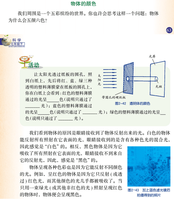

## License  
```  
Copyright (C) 2018-2020 YuqiaoZhang

This program is free software: you can redistribute it and/or modify it under the terms of the GNU Lesser General Public License as published by the Free Software Foundation, either version 3 of the License, or (at your option) any later version.

This program is distributed in the hope that it will be useful, but WITHOUT ANY WARRANTY; without even the implied warranty of MERCHANTABILITY or FITNESS FOR A PARTICULAR PURPOSE.  See the GNU Lesser General Public License for more details.

You should have received a copy of the GNU Lesser General Public License along with this program.  If not, see <https://www.gnu.org/licenses/>
```  
  
## Alpha通道  
> Porter在1984年提出了Alpha通道（1.[Porter 1984]），目前在实时渲染中已被广泛地用于模拟物体的透明效果。  

> 我们约定对应到同一个像素（Pixel）$[ C_{Final} \, A_{Final} ]$的一系列片元（Fragment）的颜色、Alpha、深度为三元组$[ C_i A_i Z_i ]$，如图：  
>   
>   
>   
> 那么该像素最终的颜色$C_{Final} = {\displaystyle{\sum_{i = 0}^n}} ( ( {\displaystyle\prod_{z_j \operatorname{Nearer} Z_i}} 1 - A_j )  A_i C_i )$。  
//其中：$\operatorname{V} ( Z_i ) = {\displaystyle\prod_{z_j \operavtorname{Nearer} Z_i}} 1 - A_j$又被称为可见性函数（原因会在之后解释）。  
因此，以上等式又可以写作：$C_{Final} = {\displaystyle{\sum_{i = 0}^n}} ( \operatorname{V} ( Z_i ) A_i C_i )$。  

> 值得注意的是，在物理含义上， Alpha模拟的是局部覆盖（Partial Coverage）而非透射率（Transmittance）。  
>   
> Alpha的含义是片元覆盖的面积占像素面积的比例（这也是我们用标量float而非向量RGB来表示Alpha的原因；这种情况在一些文献中被称作波长无关的（Wavelength-Independent））。比如，我们透过一条蓝色的真丝围巾观察一块红色的砖，我们看到砖的颜色大体为蓝色和红色“**相加**”； 真丝围巾的纤维本身是不透明的，只是真丝围巾的纤维之间存在着间隙，我们通过这些间隙看到了红色的砖，即真丝围巾“局部覆盖”了砖。  
>   
> 而透射率是波长相关的（Wavelengh-Dependent）；比如，我们透过一块蓝色的塑料薄膜观察一块红色的砖，我们看到的砖的颜色大体为黑色（即蓝色和红色“**相乘**”）；红色的砖只反射红色的光，而蓝色的塑料薄膜只允许蓝色的光通过，红色的砖的反射光全部会被蓝色的塑料薄膜吸收，即呈现出黑色。//参考文献：[《科学七年级下册》（ISBN: 9787553603162）/第2章对环境的感觉/第4节光的颜色/物体的颜色]，如图：  
>   
>    
>   
> 如果需要模拟透射率相关的效果，那么我们应当使用参与介质（Participating Media）（2.[Yusor 2013]、3.[Hoobler 2016]）相关的技术。  
  
> 根据Alpha的含义，不难理解可见性函数$\operatorname{V} ( Z_i ) = {\displaystyle\prod_{z_j \operatorname{Nearer} Z_i}} 1 - A_j$的原因。  
因为只有比当前片元“更近”（Nearer）的片元才会局部覆盖当前片元。（一些文献中将可见性函数$\operatorname{V} ( Z_i )$称作透射率$\operatorname{T} ( Z_i )$，在严格意义上是错误的。）  
 
## 顺序性透明  
> 在实时渲染中，比较经典的做法是将几何体排序后用Over/Under操作（1\.[Porter 1984]、4\. [Dunn 2014]）以递归的方式求解$C_{Final}$：  
>> 1\.OpaquePass 绘制不透明物体，得到BackgroundColor和BackgroundDepth。  
>> 2\.TransparencyPass 将BackgroundDepth用于深度测试（关闭深度写入）将透明物体从后往前/从前往后排序后用Over/Under操作以递归的方式求解$C_{Final}$。  

> Over操作  
>> 将片元从后往前排序允许用Over操作以递归的方式求解$C_{Final}$  
$C_{Final\_0}=BackgroundColor$  
$C_{Final\_n}=( A_nC_n)+\lparen1-A_n) C_{Final\_n-1}$ 
  
> Under操作
>> 将片元从前往后排序允许用Under操作以递归的方式求解$C_{Final}$  
$C_{Final\_0}=0$  
$A_{Total\_0}=1$  
$C_{Final\_n}=A_{Total\_n-1}( A_nC_n)+C_{Final\_n-1}$  
$A_{Total\_n}=A_{Total\_n-1}( 1-A_n)$ //注：我们观察到，在Under操作中，$A_{Total}$即可见性函数$\operatorname{V} ( Z_i )$  
OpaquePass得到的图像将在最后以A = 1, C = BackgroundColor的形式合成上去  
  
> 可以用数学归纳法证明，Over操作和Under操作是等价的，都可以基于${\displaystyle{\sum_{i = 0}^n}} ( \operatorname{V} ( Z_i ) A_i C_i )$正确地求出$C_{Final}$  
  
> 在严格意义上，只有将**片元**从后往前/从前往后排序，才能保证Over/Under操作的正确性。然而在实时渲染中，排序的粒度是基于**物体**而非基于**片元**；如果物体内部存在穿插，那么片元的顺序将不符合从后往前/从前往后，从而导致Over/Under操作的结果存在错误。因此，人们不得不探索OIT算法来解决这个问题。  
  
> //注：实际上，从前往后/从后往前的顺序还会导致相同材质的物体无法合批，从而导致状态切换过多，对性能造成不利影响。  
  
## 深度剥离（Depth Peeling）
> 深度剥离（5.[Everitt 2001]）是一种比较古老的在实时渲染中被实际应用的OIT算法。  
  
### Render Pass  
>> 1\.OpaquePass  
绘制不透明物体，得到BackgroundColor和BackgroundDepth。  
  
>> 2\.NearestLayerPass //GeometryPass  
将Depth初始化为BackgroundDepth   
开启深度测试（NearerOrEqual）和深度写入  
将透明物体按<材质,从前往后>排序后绘制得到NearestLayerColor和NearestLayerDepth  
并用Under操作将NearestLayerColor合成到$C_{Final}$    

>> 3\.SecondNearestLayerPass //GeometryPass  
将Depth初始化为BackgroundDepth  
开启深度测试（NearerOrEqual）和深度写入  
将NearestLayerDepth绑定到片元着色器的纹理单元 并在片元着色器中显式Discard掉Depth NearerOrEqual NearestLayerDepth的片元  
将透明物体按<材质,从前往后>排序后绘制得到SecondNearestLayerColor和SecondNearestLayerDepth  
并用Under操作将SecondNearestLayerColor合成到$C_{Final}$   
  
>> 4\.ThirdNearestLayerPass //GeometryPass  
将Depth初始化为BackgroundDepth  
开启深度测试（NearerOrEqual）和深度写入  
将SecondNearestLayerDepth绑定到片元着色器的纹理单元 //之后的操作同上，从略...  

>> 以此类推... // N个Pass可以剥离得到N个最近的层，应用程序可以根据自身的需求选择Pass的个数   
  
>> N+2\.CompositePass //FullScreenTrianglePass  
最后用Under操作将OpaquePass得到的BackgroundColor合成到$C_{Final}$  

> //注：深度剥离本身并不依赖于片元的顺序，之所以将透明物体从前往后排序是为了充分发挥硬件的EarlyDepthTest来提升性能   

> 在理论上，深度剥离也可以从远到近剥离各层，并用Over操作合成到$C_{Final}$。  
但是，在Under操作中，如果应用程序选择的Pass个数过低，不能剥离得到所有的层，那么最远处的若干层会被忽略。  
显然，可见性函数$\operatorname{V} ( Z_i )$是单调递减的。因此，最远处的若干层对$C_{Final}$的贡献是较低的，被忽略后造成的误差也相对较低。这就是深度剥离采用Under操作而非Over操作的原因。  
  
### 综合评价  
> 显然，深度剥离有一个显著的缺陷——Pass个数过多——在效率上存在着比较严重的问题；因此在被提出以后的数十年间并没有流行起来。  
     
## 随机透明（Stochastic Transparency）  
> 可见性函数$\operatorname{V} ( Z_i ) =  {\displaystyle\prod_{z_j \operatorname{Nearer} Z_i}} ( 1 - A_j )$的求解依赖于片元的顺序，导致了$C_{Final} = {\displaystyle{\sum_{i = 0}^n}} ( \operatorname{V} ( Z_i )  A_i C_i )$的求解依赖于片元的顺序。基于这个事实，Enderton在2010年提出了随机透明：随机透明基于概率论的原理，利用硬件的MSAA特性进行随机抽样，给出了一种顺序无关地求解可见性函数$\operatorname{V} ( Z_i )$的方式，以达到以顺序无关的方式求解$C_{Final}$的目的（6.[Enderton 2010]）。  
    
### 随机深度（Stochastic Depth）  
> 在开启MSAA的情况下，我们约定像素（Pixel）、片元（Fragment）和采样点（Sample）的对应关系如图：  
> 
>   
>
> 一个像素对应于若干个采样点（比如，演示图中一个像素对应于4个采样点，即4X MSAA）；同时，一个像素也对应于若干个片元。  
但是，同一像素中的同一采样点最终只可能被该像素对应的一系列片元中的某一个片元占据（由于存储空间的限制，只能存储一个片元，这是显然的）  
>   
> 并且，在接下来的讨论中，我们约定：  
$Z_j$指对应于同一像素的一系列片元$Z_0$ $Z_1$ $Z_2$ ... $Z_n$中任意的某一个片元  
$Z_s$指在最终生成的Depth图像（在具体实现中即StochasticDepth）中存储的片元（由于存储空间的限制，只能存储一个片元，图像中的任意一个采样点最终只可能被该像素对应的一系列片元$Z_0$ $Z_1$ $Z_2$ ... $Z_n$中的某一个片元占据）  
$Z_i$指当前讨论的片元（在具体实现中，可以认为是当前片元着色器执行的片元）  

> 我们设：   
通过设置gl_SampleMask/SV_Coverage的值，使片元$[C_i A_i Z_i]$在生成采样点$[ Z_i ]$时，每个采样点被覆盖的概率为$A_i$  
开启深度测试和深度写入，使较近的片元生成的采样点一定覆盖较远的片元生成的采样点  
不同片元生成采样点时，每个采样点被覆盖的概率相互独立（Uncorrelated）  

> 首先，我们有：对最终生成的Depth图像中的任意采样点$[C_s A_s Z_s]$，对该采样点所属的像素对应的一系列片元中的任意片元$[C_i A_i Z_i]$，满足$Z_i \operatorname{NearerOrEqual} Z_s$的概率即为可见性函数$\operatorname{V} ( Z_i ) = {\displaystyle\prod_{z_j \operatorname{Nearer} Z_i}} 1 - A_j$。  
>> 
>> 证明：    
>> 
>> 由于“较近的片元生成的采样点一定覆盖较远的片元生成的采样点“，对任意片元$[C_i A_i Z_i]$，如果满足$Z_i \operatorname{NearerOrEqual} Z_s$，那么表明最终生成的Depth图像中的采样点被片元$[ C_i A_i Z_i ]$或被比片元$[ C_i A_i Z_i ]$更远的片元占据，即最终生成的Depth图像中的采样点**不被**比片元$[C_i A_i Z_i]$更近的任意片元$[C_j A_j Z_j]$占据  
>>   
>> 由于最终生成的Depth图像中的采样点**不被**片元$[C_j A_j Z_j]$占据的概率为1 - $A_j$，且概率之间相互独立，根据乘法原理，最终的概率为各概率相乘，即${\displaystyle\prod_{z_j \operatorname{Nearer} Z_i}} （ 1 - A_j ）$。  

> 我们设，在MSAA中，1个像素对应的采样点个数为S，满足$Z_i \operatorname{NearerOrEqual} Z_s$的采样点的个数为$\operatorname{Count} ( Z_i )$，$\operatorname{SV}( Z_i ) = \frac{ \operatorname{Count} ( Z_i ) }{S}$   

> 显然，$\operatorname{SV} ( Z_i )$的数学期望为$\operatorname{V} ( Z_i )$。  
由于$\operatorname{Count} ( Z_i )$可以通过纹理采样得到，可以用$\operatorname{SV} ( Z_i )$估计可见性函数$\operatorname{V} ( Z_i )$。 //注：在OpenGL中，需要启用ARB_texture_multisample扩展才能用texelFetch对sampler2DMS进行采样   
//“估计”的严格证明需要用到数理统计的相关知识，从略。  
  
### Alpha校正（Alpha Correction）  
> 可以用数学归纳法证明：${\displaystyle{\sum_{i = 0}^n}} ( \operatorname{V} ( Z_i ) A_i ) = 1 - {\displaystyle{\prod_{i = 0}^n}} ( 1 - A_i )$。  
>> 
>> 1\.基本情况：  
>> 
>> 当n=0时  
>> 
>> 左边 = ${\displaystyle{\sum_{i = 0}^0}} ( \operatorname{V} ( Z_i ) A_i )$  
>>  = $\operatorname{V} ( Z_0 ) A_0$  
>> = $1 \cdot A_0$  
>> = $A_0$  
>> 
>> 右边 = $1 - {\displaystyle{\prod_{i = 0}^0}} ( 1 - A_i )$  
>> = $1 - ( 1 - A_0 )$  
>> = $A_0$  
>> 
>> 左边 = 右边 等式成立  
>> 命题得证  
>> 
>> 2\.归纳步进：
>> 
>> 设当n=k时命题成立，下面证明当n=k+1时命题也成立  
>> 左边 = ${\displaystyle{\sum_{i = 0}^{k + 1}}} ( \operatorname{V} ( Z_i ) A_i )$  
>> = ${\displaystyle{\sum_{i = 0}^k}} ( \operatorname{V} ( Z_i ) A_i ) + \operatorname{V} ( Z_{k+1} ) A_{k+1}$  
>> = $1 - {\displaystyle{\prod_{i = 0}^k}} ( 1 - A_i ) + \operatorname{V} ( Z_{k+1} ) A_{k+1}$  
>> = $1 - {\displaystyle{\prod_{i = 0}^k}} ( 1 - A_i ) + ( {\displaystyle{\prod_{i=0}^k}} ( 1 - A_i ) ) \cdot A_{k+1}$   
>> = $1 - ( {\displaystyle{\prod_{i = 0}^k}} ( 1 - A_i )) \cdot ( 1 - A_{k+1} )$  
>> = $1 - {\displaystyle{\prod_{i = 0}^{k + 1}}} ( 1 - A_i )$   
>> 
>> 右边 = $1 - {\displaystyle{\prod_{i = 0}^{k + 1}}} ( 1 - A_i )$ 
>> 
>> 左边 = 右边 等式成立  
>> 命题得证  

> 显然，${\displaystyle{\sum_{i = 0}^n}} ( \operatorname{SV} ( Z_i ) A_i )$的数学期望为${\displaystyle{\sum_{i = 0}^n}} ( \operatorname{V} ( Z_i ) A_i )$。  
>   
> 由于${\displaystyle{\sum_{i = 0}^n}} ( \operatorname{V} ( Z_i ) A_i ) = 1 - {\displaystyle{\prod_{i = 0}^n}} ( 1 - A_i )$，即${\displaystyle{\sum_{i = 0}^n}} ( \operatorname{SV} ( Z_i ) A_i )$的数学期望为
$1-\prod_i ( 1-A_i )$。  
  
> Alpha校正可以认为是对$\operatorname{SV} ( Z_i )$进行归一化（Normalize）：  
>>
>> 即假定$\frac{\operatorname{SV} ( Z_i )}{ {\displaystyle{\sum_{i = 0}^n}} ( \operatorname{SV} ( Z_i ) A_i )} = \frac{\operatorname{V} ( Z_i )}{ {\displaystyle{\sum_{i = 0}^n}} ( \operatorname{V} ( Z_i ) A_i ) }$，从而得到${\operatorname{V} ( Z_i )} = {\operatorname{SV} ( Z_i )}{\frac{ {\displaystyle{\sum_{i = 0}^n}} ( \operatorname{V} ( Z_i ) A_i ) }{ {\displaystyle{\sum_{i = 0}^n}} ( \operatorname{SV} ( Z_i ） A_i ）}} = { \operatorname{SV}( Z_i )}{\frac{1 - {\displaystyle{\prod_{i = 0}^n}} ( 1-A_i )}{ {\displaystyle{\sum_{i = 0}^n}} ( \operatorname{SV} ( Z_i ) A_i )}}$。  
  
### Render Pass  
>> 1\.OpaquePass  
>>> 绘制不透明物体，得到BackgroundColor和BackgroundDepth  
>>
>> 2\.StochasticDepthPass //GeometryPass  
>>> 将Depth初始化为BackgroundDepth  
>>> 开启MSAA  
>>> 开启深度测试（NearerOrEqual）和深度写入  
>>> 用伪随机函数基于片元$[ C_i A_i Z_i ]$的$A_i$生成gl_SampleMask/SV_Coverage的值   
>>> 将透明物体按<材质,从前往后>排序后绘制得到StochasticDepth //注：随机透明本身并不依赖于片元的顺序，之所以从前往后排序是为了充分发挥硬件的EarlyDepthTest来提升性能  
>>>> 值得注意的是：  
>>>> 1\.StochasticDepthPass开启的MSAA是用于随机抽样的，随机透明本身并不要求除StochasticDepthPass以外的Pass开启MSAA  
>>>> 如果应用程序有空间性反走样（Spatial AntiAliasing）的需求，那么可以在除StochasticDepthPass以外的Pass开启MSAA（当然，也可以使用其它的空间性反走样算法（比如：FXAA））  
>>>> 除StochasticDepthPass以外的Pass用于空间反走样的MSAA和StochasticDepthPass用于随机抽样的MSAA并没有任何关系（比如：允许在用于空间反走样的MSAA是4X的同时，用于随机抽>>> 样的MSAA为8X）       
>>>> 2\.为了确保采样点被片元覆盖的概率相互独立，必须用伪随机函数基于片元$[ C_i A_i Z_i ]$的$A_i$生成gl_SampleMask/SV_Coverage的值，而不得使用硬件的AlphaToCoverage特性。  
>>>> 3\.在AccumulatePass中计算$\operatorname{SV}( Z_i)$为着色点的深度；为了保持一致，应当在片元着色器中将着色点的深度写入到gl_FragDepth/SV_Depth（在默认情况下，采样点而非着色点的深度会被写入到最终生成的Depth图像中）。  
>>>> 4\.由于硬件的限制，MSAA最多为8X，即1个片元对应的采样点的个数最多为8；在论文原文中，作者提出可以使用多个Pass来模拟更多的采样点（6.[Enderton 2010]），但是出于效率的原因，实际应用中往往只使用1个Pass。  
>>
>> 3\.AccumulateAndTotalAlphaPass //GeometryPass  
>>> 将Depth初始化为BackgroundDepth   
>>> 开启深度测试关闭深度写入   
>>> 将StochasticDepth绑定到片元着色器的纹理单元并在片元着色器采样纹理得到$\operatorname{SV} ( Z_i )$  
>>> 开启MRT和SeparateBlend/IndependentBlend  
>>> 
>>> 将透明物体按材质排序后绘制得到：StochasticColor = ${\displaystyle\sum_{i = 0}^n} \operatorname{SV} ( Z_i )  A_i C_i$、CorrectAlphaTotal = $1 - {\displaystyle\prod_{i = 0}^n} ( 1 - A_i )$、StochasticTotalAlpha = ${\displaystyle\sum_{i = 0}^n} ( \operatorname{SV} ( Z_i ) A_i )$   
>>> 注：  
>>> 由于关闭深度写入，透明物体的前后顺序不再对绘制的性能产生影响，只按材质排序  
>>> AlphaTotal和TotalAlpha之间的关系为：TotalAlpha = 1 – AlphaTotal //术语”TotalAlpha”来自随机透明（6.[Enderton 2010]） //术语”AlphaTotal”来自Under操作（1.>> [Porter 1984]、4. [Dunn 2014]）  
>>> StochasticTotalAlpha只有在启用Alpha校正时才会被用到（理论上，在没有启用Alpha校正时，可以省1个RT）  
>>>   
>>> 注：
>>> 在论文原文中，AccumulatePass（计算StochasticColor和StochasticTotalAlpha）和TotalAlphaPass（计算CorrectAlphaTotal）是2个分离的Pass（6.[Enderton 2010]）  
>>> 但是，在实际中，完全可以将它们合并到同一个Pass   
>>> 这种情况的出现可能是由于SeparateBlend/IndependentBlend在论文发表时并没有被硬件广泛支持   
 
>> 4\.CompositePass //FullScreenTrianglePass  
>>> 没有启用Alpha校正时，透明物体对$C_{Final}$的总贡献 TransparentColor = ${\displaystyle\sum_{i = 0}^n} \operatorname{SV} ( Z_i )  A_i C_i$ = StochasticColor    
>>>   
>>> 在启用Alpha校正时，透明物体对$C_{Final}$的总贡献   
TransparentColor = ${\begin{cases} {\displaystyle\sum_{i = 0}^n} {  ( \operatorname{SV} ( Z_i ) \frac{1- {\displaystyle\prod_{i = 0}^n} ( 1 - A_i ) }{ {\displaystyle\sum_{i = 0}^n} ( \operatorname{SV}( Z_i ) A_i )} ) A_i C_i  } &{if \; {\displaystyle\sum_{i = 0}^n} {\operatorname{SV}( Z_i ) A_i)} > 0} \\0 &{if \; {\displaystyle\sum_{i = 0}^n} \operatorname{SV}( Z_i ) A_i = 0} \end{cases}}$   
= ${\begin{cases} {({\displaystyle\sum_{i = 0}^n}{\operatorname{SV}( Z_i )} A_i C_i)}{\frac{1 - {\displaystyle\prod_{i = 0}^n}( 1 - A_i )}{{\displaystyle\sum_{i = 0}^n}(\operatorname{SV}( Z_i ) A_i)}} &{if\;{\displaystyle\sum_{i = 0}^n} ( \operatorname{SV}( Z_i ) A_i ) > 0} \\0 &{if\;{\displaystyle\sum_{i = 0}^n}{({\operatorname{SV}( Z_i)}A_i)}=0} \end{cases}}$  
= ${\begin{cases} \text{StochasticColor} \frac{ 1 - \text{CorrectAlphaTotal}}{\text{StochasticTotalAlpha}} &{if\;{\displaystyle\sum_{i = 0}^n}{({\operatorname{SV}( Z_i )}A_i)} > 0} \\0 &{if\;{\displaystyle\sum_{i = 0}^n} ( \operatorname{SV}( Z_i ) A_i ) = 0} \end{cases}}$   
//注：显然，不透明物体的StochasticTotalAlpha为0；但是，由于采样点是随机生成的，透明物体的StochasticTotalAlpha也可能为0  
>>>   
>>> 随后，基于CorrectAlphaTotal用Over操作将TransparentColor合成到$C_{Final}$（目前的$C_{Final}$中已有OpaquePass得到的BackgroundColor，$C_{Final}$ = TransparentColor + CorrectAlphaTotal × BackgroundColor ） //注：可以在片元着色器中输出TransparentColor和CorrectAlphaTotal，用硬件的AlphaBlend阶段实现Over操作  

### Tile/On-Chip Memory  
> 随机透明在本质上是比较适合移动GPU的。  
>  
> 在传统的桌面GPU上，随机透明的性能瓶颈在于MSAA，1个片元对应于S个采样点的MSAA会使带宽的开销增加S倍。  
>  
> 但是，在移动GPU上，这个问题得到了有效的解决，可以将开启MSAA的图像保存在Tile/On-Chip Memory中，并在RenderPass结束后丢弃，并不会与主存进行通信，从而将带宽开销降低到几乎为零。  
次世代的API允许应用程序显式地对此进行设置：使用VK_IMAGE_USAGE_TRANSIENT_ATTACHMENT_BIT(Vulkan) / MTLStorageModeMemoryless(Metal)可以将图像的存储模式显式地设置为Tile/On-Chip Memory（在RenderPass结束后丢弃，并不会写回主存）；不过在片元着色器（Fragment Shader）中，使用该存储模式的图像不再被允许用传统的TextureUnit来读取，而必须用Subpass Input(Vulkan) / \[color(m)\]Attribute(Metal)来读取。  
传统的API并不允许将图像的存储模式显式地设置为Tile/On-Chip Memory，但是可以用FrameBufferFetch(OpenGL) / PixelLocalStorage(OpenGL)进行暗示（16.[Bjorge 2014] ）。  
  
#### Vulkan   
  
> 在Vulkan中，1个RenderPass由若干个SubPass组成，RenderPass中的不同Attachment的MSAA设置并不要求相同，但是同一SubPass引用的所有ColorAttachment和DepthStencilAttachment的MSAA设置应当相同（即与调用DrawCall时所绑定的PipelineState中的MultisampleState相同）。  
>     
> 随机透明可以在1个RenderPass中实现，具体如下： //假设应用程序并没有开启MSAA用于空间反走样  
  
```  
    RenderPass:  
        Attachment:  
            0.FinalColor
            1.BackGroupDepth
            2.StochasticDepth (MSAA)
            3.StochasticColor
            4.CorrectAlphaTotal
            5.StochasticTotalAlpha
        SubPass:  
            0.OpaquePass:
                ColorAttachment: 0.FinalColor //BackGroupColor->FinalColor
                DepthStencilAttachment: 1.BackGroupDepth  
            1.Z_CopyPass_Mentioned_In_StochasticDepthPass_Above_Z: //Rasterization MSAA
                InputAttachment: 1.BackGroupDepth
                ColorAttachment: 2.StochasticDepth (MSAA)  
            2.StochasticDepthPass: //Rasterization MSAA
                DepthStencilAttachment: 2.StochasticDepth (MSAA)  
            3.AccumulateAndTotalAlphaPass:
                InputAttachment: 2.StochasticDepth (MSAA)
                ColorAttachment: 3.StochasticColor 4.CorrectAlphaTotal 5.StochasticTotalAlpha
                DepthStencilAttachment: 1.BackGroupDepth  
            4.CompositePass:
                InputAttachment: 3.StochasticColor 4.CorrectAlphaTotal  5.StochasticTotalAlpha
                ColorAttachment: 0.FinalColor  //TransparentColor+CorrectAlphaTotal×BackgroundColor->FinalColor //用硬件的AlphaBlend阶段实现Over操作  
        Dependency:
            0.SrcSubPass:0 -> DstSubPass:1
                //DepthStencilAttachment->InputAttachment: 1.BackGroupDepth
            1.SrcSubPass:1 -> DstSubPass:2
                //ColorAttachment->DepthStencilAttachment: 2.StochasticDepth (MSAA)
            2.SrcSubPass:2 -> DstSubPass:3
                //DepthStencilAttachment->InputAttachment: 2.StochasticDepth (MSAA)
            3.SrcSubPass:3 -> DstSubPass:4
                //ColorAttachment->ColorAttachment: 0.FinalColor //SubPassDependencyChain: 0->1->2->3->4
                //ColorAttachment->InputAttachment: 3.StochasticColor
                //ColorAttachment->InputAttachment: 4.CorrectAlphaTotal
                //ColorAttachment->InputAttachment: 5.StochasticTotalAlpha  
```  
  
#### Metal  

> Metal在API层面并没有InputAttachment的概念，而是通过\[color(m)\]Attribute允许在片元着色器中读取ColorAttachment。  
但是，这样的设计存在着限制：\[color(m)\]Attribute只允许读取ColorAttachment，而不允许读取DepthAttachment，需要增加1个额外的ColorAttachment并将Depth写入到该ColorAttachment中（17.[Apple]）。  
该限制的原因，可能与“D3D12_RESOURCE_FLAG_DENY_SHADER_RESOURCE“中的说明（18\.\[Microsoft\]）有一定关联，即在Apple的GPU上，不允许读取DepthAttachment可以减少带宽开销。  
> 
> 并且，在Metal中开启MSAA时，通过\[color(m)\]Attribute读取ColorAttachment会导致片元着色器对每个采样点执行一次，得到ColorAttachment在该采样点处的值，从而导致无法求解$\operatorname{SV}( Z_i )$（因为在片元着色器的一次执行中，我们无法得到所有采样点的数据，而只能得到某一个采样点的数据）。  
因此，硬件的MSAA不可用，我们只能尝试用多个ColorAttachment来模拟MSAA，考虑到ColorAttachment的存在着个数上限（A7->4个 A8,A9,A10,A11->8个）和大小上限（A7->128位 A8,A9,A10->256位 A11->512位），最多可以模拟20X MSAA。  
由于没有开启硬件的MSAA，硬件的深度测试不可用（DepthAttachment中只有1个采样点），只能在片元着色器中基于**可编程融合**以软件的方式模拟MSAA的深度测试和深度写入，硬件会保证该RMW操作的原子性（下文在介绍K-Buffer时会对**可编程融合**的具体细节进行介绍）。  
>  
> //注：Metal中不存在SubPass的概念，因此缺少某种将DepthAttachment转换成InputAttachment的屏障（Barrier）机制。  
>  
> 随机透明在Metal中也可以在1个RenderPass中实现，具体如下： //假设应用程序并没有开启MSAA用于空间反走样  
  
```  
    RenderPassDescriptor:
        ColorAttachment:
            0.FinalColor //Load:Clear //Store:Store //Format:R10G10B10A2_UNORM //HDR10
            1.StochasticDepth0123 //Load:Clear //Store:DontCare //Format:R16G16B16A16_FLOAT
            2.StochasticDepth4567 //Load:Clear //Store:DontCare //Format:R16G16B16A16_FLOAT
            3.StochasticDepth89AB //Load:Clear //Store:DontCare //Format:R16G16B16A16_FLOAT
            4.StochasticDepthCDEF //Load:Clear //Store:DontCare //Format:R16G16B16A16_FLOAT
            5.StochasticColor //Load:Clear //Store:DontCare //Format:R10G10B10A2_UNORM //HDR10
            6.CorrectAlphaTotal	 //Load:Clear //Store:DontCare //Format:R8_UNORM
            7.StochasticTotalAlpha //Load:Clear //Store:DontCare //Format:R16_FLOAT //R8的精度不够
            //注：可以将[color(6)]和[color(7)]合并到同一个ColorAttachment后，再增加一个StochasticDepthGHIJ，即可模拟20X MSAA。    
        DepthAttachment:
            Depth //Load:Clear //Store:DontCare  
    RenderCommandEncoder:
        0.OpaquePass:
            BackgroundColor->Color[0]
            BackgroundDepth->Depth
        1.StochasticDepthPass:
            //复用Depth中的BackgroundDepth，开启深度测试，关闭深度写入；同时开启[[early_fragment_tests]]，使用硬件的深度测试剔除掉比“Background”更远的片元
            ...->SampleMask
            Read: color[1]/color[2]/color[3]/color[4]->16X MSAA
            Modify: ...
            Write: 16X MSAA->color[1]/color[2]/color[3]/color[4]
        2.AccumulateAndTotalAlphaPass:
            //复用Depth中的BackgroundDepth
            color[1]/color[2]/color[3]/color[4]->SV(Zi)
            ...->Color[5]
            ...->Color[6]
            ...->Color[7]
        3.CompositePass:
            Color[5]->...
            Color[6]->...
            Color[7]->...
            ...->TransparentColor
            ...->CorrectAlphaTotal
            Color[0]->BackgroundColor
            TransparentColor+CorrectAlphaTotal*BackgroundColor->Color[0]  
```  
  
### 综合评价  
  
> 由于移动GPU上的MSAA是高效的，随机透明在本质上是比较适合移动GPU的。  
我们可以使用次世代API充分挖掘移动GPU的相关优势。  
>  
> 但是，由于Metal在设计上的限制，导致我们不得不在片元着色器中基于**可编程融合**以软件的方式模拟MSAA的深度测试和深度写入；不过，Metal却又允许我们在一个几何体Pass中模拟最多20X的MSAA（在桌面GPU上，需要用多个Pass才能模拟8X以上MSAA）。  
//当然，在Metal上像桌面GPU那样使用多个RenderPass绘制并不会产生这些问题；但是，很有可能会导致开启MSAA的图像被从Tile/On-Chip Memory中写回主存，产生大量的带宽开销   
>  
> 显然，顶点着色器没有ColorAttachment，并且不会读写Tile/On-Chip Memory，因此，顶点着色器并不会受益于Tile/On-Chip Memory，移动GPU擅长片元处理而不擅长几何处理（10.[Harris 2019]）。  
随机透明的一个缺陷在于：随机透明需要2个几何体Pass（StochasticDepthPass和AccumulateAndTotalAlphaPass），这可能会使几何处理成为性能的瓶颈。  
>   
> 随机透明的误差在于随机抽样本身；不过，Alpha校正可以在很好地消除随机抽样产生的噪声，在效果上并不会产生太大的影响。  
    
### Demo  
> Demo地址：[https://gitee.com/YuqiaoZhang/StochasticTransparency](https://gitee.com/YuqiaoZhang/StochasticTransparency) / [https://github.com/YuqiaoZhang/StochasticTransparency](https://github.com/YuqiaoZhang/StochasticTransparency)。该Demo改编自NVIDIA SDK11 Samples中的StochasticTransparency（9.[Bavoil 2011]），在NVIDIA提供的原始代码中，存在着3个比较严重的问题：  
>> 1\.我在前文中指出：“随机透明本身并不要求除StochasticDepthPass以外的Pass开启MSAA”； 在NVIDIA提供的原始代码中，所有Pass都使用了相同的MSAA设置，导致随机透明的帧率反而低于深度剥离（个人测试的结果是：修正该问题后，帧率从670提升至1170（用于对比的深度剥离为1070））。  
>> 2\.我在前文中指出：“论文原文中的2个分离的Pass（AccumulatePass和TotalAlphaPass）应当合并到同一个Pass”；NVIDIA提供的原始代码并没有这么做（个人测试的结果是：修正该问题后，帧率从1170提升至1370）。  
>> 3\.我在前文中指出：“在AccumulatePass中计算$\operatorname{SV}( Z_i )$时，$Z_i$为着色点的深度；为了保持一致，在StochasticDepthPass中应当在片元着色器中将着色点的深度写入到gl_FragDepth/SV_Depth”；NVIDIA提供的原始代码并没有这么做，导致在求解$\operatorname{SV}( Z_i )$时，$Z_i$ Equal $Z_s$几乎不可能成立，产生较大的误差；不过Alpha校正可以很好地修正这个误差，在效果上并没有产生太大的影响。  
  
## K-Buffer  
> 在Porter提出Alpha通道的同一年，Carpenter提出了A-Buffer：在A-Buffer中，每个像素对应于一个链表，存放对应到该像素的所有片元；基于深度对链表中的片元排序后，用Over/Under操作即可得到$C_{Final}$（11.[Carpenter 1984]）。虽然，目前的硬件在理论上已经可以通过UAV(Direct3D)和原子操作实现A-Buffer，但是，由于实现的过程极其繁琐（编程是一门艺术，A-Buffer的实现极不优雅）且效率低下（主要是链表的地址不连续导致缓存命中率下降），几乎不存在A-Buffer的实际应用。  
>
> 在2007年，Bavoil在A-Buffer的基础上进行了改进，将每个像素对应的片元个数限定为K个，提出了更具有实用价值的K-Buffer（12.[Bavoil 2007]）。  
  
### RMW操作  
> 在生成K-Buffer的Pass中，在每个片元生成时会进行以下RMW（Read Modify Write，读取-修改-写入）操作：  
> 1.Read：读取当前片元所对应的像素所对应的K个片元。  
> 2.Modify：结合当前片元，对读取得到的K个片元进行修改。 //在OIT算法中，一般是将当前片元插入到这K个片元中得到K+1个片元，并找出两个“最接近”的片元进行融合，再次得到K个片元  
> 3.Write：将修改后的K个片元写入当前片元所对应的像素。  
     
> 对目前的硬件而言，只要在片元着色器中访问StorageImage(OpenGL/Vulkan) / UAV(Direct3D)，就可以做到每个像素对应于K个片元并且在每个片元生成时对这K个片元进行RMW操作。但是，事情远远没有这么简单，一般而言，对应于同一像素的不同片元的RMW操作必须“**互斥**”才能保证最终结果的正确性。  
  
> 在API层面，对应于同一像素的不同片元之间的同步发生在Alpha融合阶段，也就是说，这些片元在片元着色器阶段是并行执行的。  
>   
> 在桌面GPU（Sort-Last Fragment）上，对应于同一像素的不同片元的RMW操作的“**竞态条件**（Race Condition）”显得尤其显著。  
> 不妨回忆，在顺序性透明中，我们将物体从前往后/从前往后排序，并依次调用Draw Call，这意味应用程序调用Draw Call的顺序隐含着某种依赖关系。但是，GPU的设计者往往希望尽可能地提升并行度以充分挖掘GPU的性能；在实际中，GPU仍并行地处理这些Draw Call，只不过会在某个同步点进行同步，使最终结果满足应用程序所期望的依赖关系。  
> 在桌面GPU上，这个同步点发生在片元着色器之后Alpha融合之前的Reorder Buffer中（13.[Ragan-Kelley 2011]），也就是说，即使在Draw Call顺序上存在着依赖关系的片元，在GPU中也是并行处理的（即存在**竞态条件**），更不用说在同一个Draw Call中（即在应用层不存在任何期望的依赖关系）的片元。  
>  
> 在移动GPU（Tile-Based Sort-Middle）上，由于没有Reorder Buffer的存在，对应于同一像素的不同片元是串行执行的（13.[Ragan-Kelley 2011]）。这也是移动GPU并不需要Depth PrePass（10.[Harris 2019]）的原因，GPU会在EarlyDepthTest阶段确定最终覆盖像素的片元，并只为该片元执行片元着色器；由于在大多数情况下（比如绘制不透明物体），最终覆盖像素的片元只有一个，串行执行并不会对性能有太大的影响。这也解释了移动GPU排斥Discard（10.[Harris 2019]）的原因，Discard会导致GPU无法在EarlyDepthTest阶段确定最终覆盖像素的片元，可能会导致GPU为对应于同一像素的多个片元执行片元着色器，然而在移动GPU上，这些片元着色器是串行执行的，在效率上低于桌面GPU（并行执行）。  
> 但是，由于片元着色器阶段在API层面被看作是并行执行的，而且GPU硬件的内部实现是不公开的，应用程序还是不应当作出“对应于同一像素的不同片元在访问StorageImage(OpenGL/Vulkan) / UAV(Direct3D)时的RMW操作不存在**竞态条件**”的假定。还是有很多其它潜在的因素可能会对此造成影响，比如：执行依赖并不代表内存依赖，由于StorageImage(OpenGL/Vulkan) / UAV(Direct3D)并不保存在Tile/On-Chip Memory中，考虑到缓存机制的存在，虽然，对应于同一像素的不同片元是串行执行的，但是，之前的片元对StorageImage(OpenGL/Vulkan) / UAV(Direct3D)的写入并不一定会对之后的片元可见（即之前的片元写入到了缓存，而之后的片元从主存中读取；至少在API层面完全允许GPU的设计者这么做）。 //个人认为还是有必要通过实验来确定    
  
> Bavoil在2007年提出K-Buffer时，同时提出了两种硬件上的设计——片元调度（Fragment Schedule）和可编程融合（Programmable Blending）——来解决对应于同一像素的不同片元的RMW操作存在**竞态条件**的问题（12.[Bavoil 2007]）。目前，这两种设计都已经在实际中被硬件广泛支持。  
  
### 片元调度（Fragment Scheduling）  
> 片元调度对应于目前的RasterOrderView(Direct3D) / FragmentShaderInterlock(OpenGL/Vulkan) / RasterOrderGroup(Metal)（14.[D 2015]、15.[D 2017]），往往适用于桌面GPU。  
>    
> 使用片元调度实现K-Buffer的片元着色器的代码大致如下：  
    
```  
        Do Shade //这部分代码并不需要互斥
                                                
    //Enter Critical Section //进入临界区
    #if RasterOrderView(Direct3D)
        Read From ROV
    #elif FragmentShaderInterlock(OpenGL/Vulkan)
        beginInvocationInterlockARB
    #elif RasterOrderGroup(Metal)
        Read From ROG
    #endif

        Do K-Buffer RMW //这部分代码处于临界区保护内

    //Leave Critical Section //离开临界区
    #if RasterOrderView(Direct3D)
        Write To ROV
    #elif FragmentShaderInterlock(OpenGL/Vulkan)
        endInvocationInterlockARB
    #elif RasterOrderGroup(Metal)
         Write To ROG
    #endif
```  
   
> //注：在理论上，对ROV/ROG读写的内容并不重要，读写ROV/ROG只是为了进入/离开临界区（从这一点上，OpenGL/Vulkan的设计更为优雅）；“Do K-Buffer RMW”已经处于临界区的保护之中，不再有读写ROV/ROG的必要，K-Buffer的存储只需要使用常规的UAV(Direct3D) / StorageImage(OpenGL/Vulkan)即可（14.[D 2017]）。  
   
### 可编程融合（Programmable Blending）  
> 可编程融合对应于目前的FrameBufferFetch(OpenGL) / \[color(m)\]Attribute(Metal)（16.[Bjorge 2014]、17.[Apple]），往往适用于移动GPU。  
>  
> 可编程融合允许在片元着色器中读取ColorAttachment，对ColorAttachment进行RMW操作，硬件会保证对应于同一像素的不同片元对同一ColorAttachment的RMW操作的**互斥**性。我们只需要开启MRT，就可以基于可编程融合实现K-Buffer。比如，在OIT算法中，我们需要实现1个像素对应于4个片元[C A Z]构成的K-Buffer，相关的片元着色器代码（基于Metal）大致如下：  
    
```  
    struct KBuffer_ColorAttachment  
    {
        //一般[[color(0)]]是用于存放CFinal的
        half4 C0A0[[color(1)]]; //R8G8B8A8_UNORM
        half4 C1A1[[color(2)]]; //R8G8B8A8_UNORM
        half4 C2A2[[color(3)]]; //R8G8B8A8_UNORM
        half4 C3A3[[color(4)]]; //R8G8B8A8_UNORM
        half4 Z0123[[color(5)]]; //R16G16B16A16_FLOAT
    };
    
    struct KBuffer_Local
    {
        half4 CA[4]
        half Z[4]
    };

    fragment KBuffer_ColorAttachment KBufferPass_FragmentMain(..., KBuffer_ColorAttachment kbuffer_in)
    {
        CA = Shade(...) //这部分代码并不需要互斥
        Z = ... //一般即position.z

        KBuffer_Local kbuffer_local;

        //KBuffer Read操作
        kbuffer_local.Z[0] = kbuffer_in.Z0123.r; //对ColorAttachment的Read操作会进入临界区
        kbuffer_local.Z[1] = kbuffer_in.Z0123.g;
        kbuffer_local.Z[2] = kbuffer_in.Z0123.b;
        kbuffer_local.Z[3] = kbuffer_in.Z0123.a;
        kbuffer_local.CA[0] = kbuffer_in.C0A0;
        kbuffer_local.CA[1] = kbuffer_in.C1A1;
        kbuffer_local.CA[2] = kbuffer_in.C2A2;
        kbuffer_local.CA[3] = kbuffer_in.C3A3;
        
        //KBuffer Modify操作
        ... //根据应用程序的具体需求 //这部分代码处于临界区保护内
        
        //KBuffer Write操作
        KBuffer_ColorAttachment kbuffer_out;
        kbuffer_out.C0A0 = kbuffer_local.CA[0];
        kbuffer_out.C1A1 = kbuffer_local.CA[1];
        kbuffer_out.C2A2 = kbuffer_local.CA[2];
        kbuffer_out.C3A3 = kbuffer_local.CA[3];
        kbuffer_out.Z0123 = half4(kbuffer_local.Z[0], kbuffer_local.Z[1], kbuffer_local.Z[2], kbuffer_local.Z[3]); //对ColorAttachment的Write操作会离开临界区
        return kbuffer_out;
    }
```  
   
### MLAB（Mult Layer Alpha Blending，多层Alpha融合）  
> Salvi分别在2010年、2011年、2014年提出的OIT算法全都是基于K-Buffer实现的（19\.\[Salvi 2010\]、20\.\[Salvi 2011\]、21\.\[Salvi 2014\]），我们选取最新的（即2014年）的MLAB进行介绍。  
    
#### K-Buffer  
> MLAB将K-Buffer中片元的格式定义为$[ A_i C_i \, | \, 1 - A_i \, | \, Z_i ]$。  
> 1\.首先将K-Buffer中的片元全部初始化为$C_i$ = 0, $A_i$ = 0, $Z_i$ = 无限远（即[0 1 无限远]）的“空片元”。 //在实际实现中，由于$Z_i$的取值在0到1之间，只需要保证比$Z_i$所有可能的取值都远即可。  
> 2\.在片元生成时，K-Buffer的Modify操作会根据$Z_i$从近到远排序，将当前片元插入到合适的位置，得到K+1个片元；再基于Under操作的规则，将最远的2个片元融合（$[ A_i C_i \, | \, 1 - A_i \, | \, Z_i ]$和$[ A_{i+1} C_{i+1} \, | \, 1 - A_{i+1} \, | \, Z_{i+1} ]$融合后得到$[ A_i C_i + ( 1 - A_i ) A_{i+1} C_{i+1} \, | \, ( 1 - A_i ) ( 1 - A_{i+1} ) \, | \, Z_i ]$ //注：这个融合规则兼容初始化产生的“空片元”），再次得到K个片元。 //当之后插入的片元在两个被融合的片元之间时，会产生误差；根据Salvi的说法，融合最远的2个片元的误差是最小的，这可能与较远的片元对$C_{Final}$的贡献较低有一定关系（可见性函数$\operatorname{V}( Z_i )$是单调递减的，较远的片元的$\operatorname{V}( Z_i )$的值较低）。  
> 3\.最后，使用Under操作，基于K-Buffer中的K个片元，求出透明物体对$C_{Final}$的总贡献。  
   
#### Render Pass
> MLAB涉及到的RenderPass如下：  
>> 1.OpaquePass  
>>> 绘制不透明物体，得到BackgroundColor和BackgroundDepth   
>>
>> 2.KBufferPass //GeometryPass  
>>> 复用OpaquePass得到的BackgroundDepth  
>>> 开启深度测试关闭深度写入  
>>> 用Clear操作将K-Buffer中的片元全部初始化[0 1 无限远]   
>>> 将透明物体按材质排序后绘制得到K-Buffer //注：由于关闭深度写入，透明物体的前后顺序不再对绘制的性能产生影响，只按材质排序  
>>  
>> 3.CompositePass //FullScreenTrianglePass  
>>> 用Under操作，基于K-Buffer中的K个片元，求出透明物体对$C_{Final}$的总贡献TransparentColor和AlphaTotal  
>>>  
>>> 随后，基于AlphaTotal用Over操作将TransparentColor合成到$C_{Final}$（目前的$C_{Final}$中已有OpaquePass得到的BackgroundColor，$C_{Final}$ = TransparentColor + AlphaTotal × BackgroundColor） //注：可以在片元着色器中输出TransparentColor和AlphaTotal，用硬件的AlphaBlend阶段实现Over操作  
   
### Tile/On-Chip Memory  
> K-Buffer在本质上是比较适合移动GPU的。  
> 在传统的桌面GPU上，K-Buffer会使带宽的开销增加K倍。  
> 同样地，在移动GPU上，我们也可以用次世代API将K-Buffer保存在Tile/On-Chip Memory中，不与主存进行通信，从而将带宽开销降低到几乎为零。  
   
#### Vulkan  
> 由于Vulkan尚未支持FrameBufferFetch，目前无法用Vulkan基于可编程融合实现K-Buffer（当然，可以用Vulkan基于片元调度实现K-Buffer，只是片元调度并不适用于移动GPU；不过，OpenGL支持FrameBufferFetch，可以考虑用OpenGL基于可编程融合实现K-Buffer，只是OpenGL无法显式地控制将K-Buffer保存在Tile/On-Chip Memory中）。
  
#### Metal
> MLAB在Metal中可以在1个RenderPass中实现，具体如下： //假设K-Buffer中的K值为4  

```
    RenderPassDescriptor:
        ColorAttachment:
            0.FinalColor //Load:Clear //Store:Store //Format:R10G10B10A2_UNORM  //HDR10
            1.AC0_1SubA0 //Load:Clear //ClearValue:[ 0 0 0 1 ] //Store:DontCare //Format:R16G16B16A16_FLOAT
            2.AC1_1SubA1 //Load:Clear //ClearValue:[ 0 0 0 1 ] //Store:DontCare //Format:R8G8B8A8_UNORM //PixelStorage的大小存在着上限（A7->128位 A8,A9,A10->256位 A11->512位）；由于可见性函数单调递减，较远的片元贡献较低，优先考虑降低精度
            3.AC2_1SubA2 //Load:Clear //ClearValue:[ 0 0 0 1 ] //Store:DontCare //Format:R8G8B8A8_UNORM
            4.AC3_1SubA3 //Load:Clear //ClearValue:[ 0 0 0 1 ] //Store:DontCare //Format:R8G8B8A8_UNORM
            5.Z0123 //Load:Clear //ClearValue:[ 无限远 无限远 无限远 无限远 ] //Store:DontCare //Format:R16G16B16A16_FLOAT
        DepthAttachment:
            Depth //Load:Clear //Store:DontCare
    RenderCommandEncoder:
        0.OpaquePass:
            BackgroundColor->Color[0]
            BackgroundDepth->Depth
        1.KBufferPass:
            Read: Color[1]/Color[2]/Color[3]/Color[4]/Color[5]->4个Fragment
            Modify: ...
            Write: 4个Fragment->Color[1]/Color[2]/Color[3]/Color[4]/Color[5]
            //复用Depth中的BackgroundDepth
        3.CompositePass:
            Color[1]/Color[2]/Color[3]/Color[4]/Color[5]->...
            ...->TransparentColor
            ...->AlphaTotal
            Color[0]->BackgroundColor
            TransparentColor+AlphaTotal*BackgroundColor->Color[0]
```
  
### 综合评价  
> 由于移动GPU上的K-Buffer是高效的，MLAB在本质上是比较适合移动GPU的。我们可以使用次世代API充分挖掘移动GPU的相关优势。但是，由于Vulkan尚未支持FrameBufferFetch，目前无法用Vulkan基于可编程融合实现K-Buffer（不过，OpenGL支持FrameBufferFetch，可以考虑用OpenGL基于可编程融合实现K-Buffer，只是OpenGL无法显式地控制将K-Buffer保存在Tile/On-Chip Memory中）。  
>  
> 相对于随机透明而言，MLAB有一个明显的优势：只需要一个几何体Pass（KBufferPass），这对不擅长几何处理（10.[Harris 2019] ）的移动GPU而言是一个不错的福音。但是，K-Buffer的RWM操作必须“**互斥**”，对桌面GPU而言，会导致GPU无法并行处理对应于同一像素的片元，从而引入额外的开销，开销的大小取决于场景的深度复杂度（Depth Complexity）。（由于移动GPU本身就是串行处理的（13.[Ragan-Kelley 2011]），并不引入**额外**的开销）  
>  
> 当新插入的片元在两个被融合的片元之间时，K-Buffer会产生误差；不过，由于可见性函数$\operatorname{V}( Z_i )$是单调递减的，较远的片元的$\operatorname{V}( Z_i )$的值较低，融合最远的2个片元可以有效地降低误差，在效果上并不会产生太大的影响。  
  
### Demo  
> Demo地址：[https://gitee.com/YuqiaoZhang/MultiLayerAlphaBlending](https://gitee.com/YuqiaoZhang/MultiLayerAlphaBlending) / [https://github.com/YuqiaoZhang/MultiLayerAlphaBlending](https://github.com/YuqiaoZhang/MultiLayerAlphaBlending)。该Demo改编自Metal Sample Code中的Order Independent Transparency with Imageblocks（22\.\[Imbrogno 2017\]）。在Apple提供的原始代码中，用到了A11 GPU（iPhone 8以后）中才具有的特性Imageblock；但是，PixelLocalStorage(OpenGL) / Imageblock(Metal)的本质是允许自定义FrameBuffer中像素的格式（16\.\[Bjorge 2014\]、22\.\[Imbrogno 2017\]），这与K-Buffer的本质（为RMW操作构造临界区）并没有任何关系；于是我对Demo进行了修改，使用\[color(m)\]Attribute实现了相关的功能，在iPhone 6（A8 GPU）上顺利运行，**粉碎了Apple企图忽悠我换iPhone新机型的阴谋**！  
>     
> //注：Metal特性和OpenGL特性之间的对应关系为：\[Color(m)\]Attribute对应于FrameBufferFetch，本质是用于实现可编程融合；而ImageBlock对应于PixelLocalStorage，本质是用于自定义像素格式。  
  
## 加权融合（Weighted Blended）  
> 可见性函数$V( Z_i) = {\displaystyle\prod_{z_j \operatorname{Nearer} Z_i}} 1 - A_j$的求解依赖于片元的顺序，导致了$C_{Final} = {\displaystyle\sum_{i=0}^n} V( Z_i ) A_i C_i$的求解依赖于片元的顺序。同样是基于这个事实，McGuire在2013年提出了加权融合：用一个预定义的权重函数$\operatorname{W}( EyeSpaceZ_i, A_i)$作为可见性函数$\operatorname{V}( Z_i)$的估计值，从而达到以顺序无关的方式求解$C_{Final}$的目的（23\.\[McGuire 2013\]、4\.\[Dunn 2014\]）。  
  
### 权重函数  
> McGuire认为，只依赖于$EyeSpaceZ_i$的权重函数可能会导致$A_i$较低的“**极近**”的片元对$C_{Final}$产生过大的影响，权重函数应当同时依赖于$EyeSpaceZ_i$和$A_i$。同时，McGuire给出了三个建议的权重函数（经McGuire验证，当$EyeSpaceZ_i$的范围在0.1到500之间且$EyeSpaceZ_i$为16位浮点数时，效果良好）：  
> 1.${\operatorname{W}( EyeSpaceZ_i,A_i)}=\operatorname{clamp}{({\frac{10.0f}{0.00001f+{(\frac{EyeSpaceZ_i}{5.0f})}^{2.0f}+{(\frac{EyeSpaceZ_i}{200.0f})}^{6.0f}}},0.01f,3000.0f)}*A_i$  
> 2.${\operatorname{W}( EyeSpaceZ_i,A_i)}=\operatorname{clamp}{({\frac{10.0f}{0.00001f+{(\frac{EyeSpaceZ_i}{10.0f})}^{3.0f}+{(\frac{EyeSpaceZ_i}{200.0f})}^{6.0f}}},0.01f,3000.0f)}*A_i$  
> 3.${\operatorname{W}( EyeSpaceZ_i,A_i)}=\operatorname{clamp}{({\frac{0.03f}{0.00001f+{(\frac{EyeSpaceZ_i}{200.0f})}^{4.0f}}},0.01f,3000.0f)}*A_i$  
>  
> //注：根据定义，可见性函数$V( Z_i)$不可能超过1；但是，当片元“**极近**”时，权重函数的值却可能高达3000，这可能是McGuire认为权重函数需要依赖于$A_i$的原因。  
   
### 归一化  
> 在讨论随机透明的Alpha校正时，我们已经证明过：${\displaystyle\sum_{i = 0}^n}(\operatorname{V}( Z_i ) A_i) = 1 - {\displaystyle\prod_{i = 0}^n}( 1 - A_i )$。  
>  
> 归一化即假定$\frac{\operatorname{W}(EyeSpaceZ_i,A_i)}{{\displaystyle\sum_{i = 0}^n}(\operatorname{W}(EyeSpaceZ_i,A_i) A_i)}$ = $\frac{\operatorname{V}( Z_i)}{{\displaystyle\sum_{i = 0}^n}(\operatorname{V}( Z_i) A_i)}$，从而得到${\operatorname{V}( Z_i )}$=${\operatorname{W}( EyeSpaceZ_i,A_i)}{\frac{{\displaystyle\sum_{i = 0}^n}(\operatorname{V}( Z_i) A_i)}{{\displaystyle\sum_{i = 0}^n}(\operatorname{W}( EyeSpaceZ_i,A_i) A_i)}}$=${\operatorname{W}(EyeSpaceZ_i,A_i)}{\frac{1-{\displaystyle\prod_{i = 0}^n}( 1 - A_i )}{{\displaystyle\sum_{i = 0}^n}(\operatorname{W}(EyeSpaceZ_i, A_i) A_i)}}$。  
   
### Render Pass  
>> 1.OpaquePass  
>>> 绘制不透明物体，得到BackgroundColor和BackgroundDepth  
>>     
>> 2.AccumulateAndTotalAlphaPass //GeometryPass  
>>> 将Depth初始化为BackgroundDepth 开启深度测试关闭深度写入 将透明物体按材质排序后绘制得到$WeightedColor=\sum_i{({\operatorname{W}( EyeSpaceZ_i,A_i)}A_iC_i)}$、$CorrectAlphaTotal=1-\prod_i( 1-A_i)$、$WeightedTotalAlpha=\sum_i{({\operatorname{W}( EyeSpaceZ_i,A_i)}A_i)}$ //注：由于关闭深度写入，透明物体的前后顺序不再对绘制的性能产生影响，只按材质排序；AlphaTotal和TotalAlpha之间的关系为：TotalAlpha = 1 – AlphaTotal，术语”TotalAlpha”来自随机透明（6.[Enderton 2010]），术语”AlphaTotal”来自Under操作（1\.\[Porter 1984\]、4\.\[Dunn 2014\]）  
>>   
>> 3.CompositePass //FullScreenTrianglePass  
>>> 透明物体对$C_{Final}$的总贡献为：$TransparentColor=\sum_i{({({\operatorname{W}( EyeSpaceZ_i,A_i)}\frac{1-\prod_i( 1-A_i)}{\sum_i({\operatorname{W}( EyeSpaceZ_i,A_i)}A_i)})}A_iC_i)}={(\sum_i{\operatorname{W}( EyeSpaceZ_i,A_i)}A_iC_i)}{\frac{1-\prod_i( 1-A_i)}{\sum_i({\operatorname{W}( EyeSpaceZ_i,A_i)}A_i)}}=WeightedColor\frac{1-CorrectAlphaTotal}{WeightedTotalAlpha}$  
>>>   
>>> 随后，基于CorrectAlphaTotal用Over操作将TransparentColor合成到$C_{Final}$（目前的$C_{Final}$中已有OpaquePass得到的BackgroundColor，$C_{Final}=TransparentColor+CorrectAlphaTotal×BackgroundColor$） //注：可以在片元着色器中输出TransparentColor和CorrectAlphaTotal，用硬件的AlphaBlend阶段实现Over操作  
  
### 综合评价  
> 加权融合用预定义的权重函数$\operatorname{W}( EyeSpaceZ_i,A_i)$近似地表示可见性函数$\operatorname{V}( Z_i)$，省去了求解可见性函数$\operatorname{V}( Z_i)$的过程，在某种程度上可以认为是随机透明的简化版（省去了StochasticDepthPass）。当然，加权融合的误差也是最大的，因为作为可见性函数$\operatorname{V}( Z_i)$估计值的权重函数$\operatorname{W}( EyeSpaceZ_i,A_i)$与场景中的实际情况不存在任何关系。  
  
### Demo  
> Demo地址：[https://gitee.com/YuqiaoZhang/WeightedBlendedOIT](https://gitee.com/YuqiaoZhang/WeightedBlendedOIT) / [https://github.com/YuqiaoZhang/WeightedBlendedOIT](https://github.com/YuqiaoZhang/WeightedBlendedOIT)。该Demo改编自NVIDIA GameWorks Vulkan and OpenGL Samples中的Weighted Blended Order-independent Transparency（24\.\[NVIDIA\]）。加权融合是所有OIT算法中最简单的，我也并没有对Demo作任何实质性的修改。  
  
## 参考文献  
1\.\[Porter 1984\] Thomas Porter, Tom Duff. "Compositing Digital Images." SIGGRAPH 1984.  
[https://keithp.com/~keithp/porterduff/p253-porter.pdf](https://keithp.com/~keithp/porterduff/p253-porter.pdf)  
2\.\[Yusor 2013\] Egor Yusor. "Practical Implementation of Light Scattering Effects Using Epipolar Sampling and 1D Min/Max Binary Trees." GDC 2013.  
[https://software.intel.com/en-us/blogs/2013/03/18/gtd-light-scattering-sample-updated](https://software.intel.com/en-us/blogs/2013/03/18/gtd-light-scattering-sample-updated)  
[https://software.intel.com/en-us/blogs/2013/06/26/outdoor-light-scattering-sample](https://software.intel.com/en-us/blogs/2013/06/26/outdoor-light-scattering-sample)  
[https://software.intel.com/en-us/blogs/2013/09/19/otdoor-light-scattering-sample-update](https://software.intel.com/en-us/blogs/2013/09/19/otdoor-light-scattering-sample-update)  
3\.\[Hoobler 2016\] Nathan Hoobler. "Fast, Flexible, Physically-Based Volumetric Light Scattering." GDC 2016.  
[http://developer.nvidia.com/VolumetricLighting](http://developer.nvidia.com/VolumetricLighting)  
4\.\[Dunn 2014\] Alex Dunn. "Transparency (or Translucency) Rendering." NVIDIA GameWorks Blog 2014.  
[https://developer.nvidia.com/content/transparency-or-translucency-rendering](https://developer.nvidia.com/content/transparency-or-translucency-rendering)   
5\.\[Everitt 2001\] Cass Everitt. "Interactive Order-Independent Transparency." NVIDIA WhitePaper 2001.  
[https://www.nvidia.com/object/Interactive_Order_Transparency.html](https://www.nvidia.com/object/Interactive_Order_Transparency.html)  
6\.\[Enderton 2010\] Eric Enderton, Erik Sintorn, Peter Shirley, David Luebke. "Stochastic Transparency." I3D 2010.  
[https://research.nvidia.com/publication/stochastic-transparency](https://research.nvidia.com/publication/stochastic-transparency)  
7\.\[Laine 2011\] Samuli Laine, Tero Karras. "Stratified Sampling for Stochastic Transparency." EGSR 2011.  
[https://research.nvidia.com/publication/stratified-sampling-stochastic-transparency](https://research.nvidia.com/publication/stratified-sampling-stochastic-transparency)  
8\.\[McGuire 2011\] Morgan McGuire, Eric Enderton. "Colored Stochastic Shadow Maps". I3D 2011.  
[http://research.nvidia.com/publication/colored-stochastic-shadow-maps](http://research.nvidia.com/publication/colored-stochastic-shadow-maps)  
9\.\[Bavoil 2011\] Louis Bavoil, Eric Enderton. "Constant-Memory Order-Independent Transparency Techniques." NVIDIA SDK11 Samples / StochasticTransparency 2011.  
[https://developer.nvidia.com/dx11-samples](https://developer.nvidia.com/dx11-samples)  
10\.\[Harris 2019\] Pete Harris. "Arm Mali GPUs Best Practices Developer Guide." ARM Developer 2019.  
[https://developer.arm.com/solutions/graphics/developer-guides/mali-gpu-best-practices](https://developer.arm.com/solutions/graphics/developer-guides/mali-gpu-best-practices)  
11\.\[Carpenter 1984\] Loren Carpenter. "The A-buffer, an Antialiased Hidden Surface Method." SIGGRAPH 1984.  
[https://dl.acm.org/citation.cfm?id=80858](https://dl.acm.org/citation.cfm?id=80858)  
12\.\[Bavoil 2007\] Louis Bavoil, Steven Callahan, Aaron Lefohn, Joao Comba, Claudio Silva. "Multi-Fragment Effects on the GPU using the k-Buffer." I3D 2007.  
[https://i3dsymposium.github.io/2007/papers.html](https://i3dsymposium.github.io/2007/papers.html)  
13\.\[Ragan-Kelley 2011\] Jonathan Ragan-Kelley, Jaakko Lehtinen, Jiawen Chen, Michael Doggett, Frédo Durand. "Decoupled Sampling for Graphics Pipelines." ACM TOG 2011.  
[http://people.csail.mit.edu/jrk/decoupledsampling/ds.pdf](http://people.csail.mit.edu/jrk/decoupledsampling/ds.pdf)  
14\.\[D 2015\] Leigh D. "Rasterizer Order Views 101: a Primer." Intel Developer Zone 2015.  
[https://software.intel.com/en-us/gamedev/articles/rasterizer-order-views-101-a-primer](https://software.intel.com/en-us/gamedev/articles/rasterizer-order-views-101-a-primer)  
15\.\[D 2017\] Leigh D. "Order-Independent Transparency Approximation with Raster Order Views (Update 2017)." Intel Developer Zone 2017.  
[https://software.intel.com/en-us/articles/oit-approximation-with-pixel-synchronization-update-2014](https://software.intel.com/en-us/articles/oit-approximation-with-pixel-synchronization-update-2014)  
16\.\[Bjorge 2014\] Marius Bjorge, Sam Martin, Sandeep Kakarlapudi, Jan-Harald Fredriksen. "Efficient Rendering with Tile Local Storage." SIGGRAPH 2014.  
[https://community.arm.com/developer/tools-software/graphics/b/blog/posts/efficient-rendering-with-tile-local-storage](https://community.arm.com/developer/tools-software/graphics/b/blog/posts/efficient-rendering-with-tile-local-storage)  
17\.\[Apple\] Metal Sample Code / Deferred Lighting  
[https://developer.apple.com/documentation/metal/deferred_lighting](https://developer.apple.com/documentation/metal/deferred_lighting)   
18\.\[Microsoft\] Direct3D 12 Graphics / D3D12.h / D3D12_RESOURCE_FLAGS enumeration  
[https://docs.microsoft.com/en-us/windows/win32/api/d3d12/ne-d3d12-d3d12_resource_flags](https://docs.microsoft.com/en-us/windows/win32/api/d3d12/ne-d3d12-d3d12_resource_flags)    
19\.\[Salvi 2010\] Marco Salvi,Kiril Vidimce, Andrew Lauritzen, Aaron Lefohn. "Adaptive Volumetric Shadow Maps." EGSR 2010.  
[https://software.intel.com/en-us/articles/adaptive-volumetric-shadow-maps](https://software.intel.com/en-us/articles/adaptive-volumetric-shadow-maps)  
20\.\[Salvi 2011\] Marco Salvi, Jefferson Montgomery, Aaron Lefohn. "Adaptive Transparency." HPG 2011.  
[https://software.intel.com/en-us/articles/adaptive-transparency-hpg-2011](https://software.intel.com/en-us/articles/adaptive-transparency-hpg-2011)  
21\.\[Salvi 2014\] Marco Salvi, Karthik Vaidyanathan. "Multi-layer Alpha Blending." I3D 2014.  
[https://software.intel.com/en-us/articles/multi-layer-alpha-blending](https://software.intel.com/en-us/articles/multi-layer-alpha-blending)  
22\.\[Imbrogno 2017\] Michael Imbrogno. "Metal 2 on A11 – Imageblocks." Apple Developer 2017.  
[https://developer.apple.com/videos/play/tech-talks/603](https://developer.apple.com/videos/play/tech-talks/603)  
23\.\[McGuire 2013\] Morgan McGuire, Louis Bavoil. "Weighted Blended Order-Independent Transparency. " JCGT 2013.  
[http://jcgt.org/published/0002/02/09/](http://jcgt.org/published/0002/02/09/)  
24\.\[NVIDIA\] NVIDIA GameWorks Vulkan and OpenGL Samples / Weighted Blended Order-independent Transparency  
[https://github.com/NVIDIAGameWorks/GraphicsSamples/tree/master/samples/gl4-kepler/WeightedBlendedOIT](https://github.com/NVIDIAGameWorks/GraphicsSamples/tree/master/samples/gl4-kepler/WeightedBlendedOIT)  
&nbsp;  
