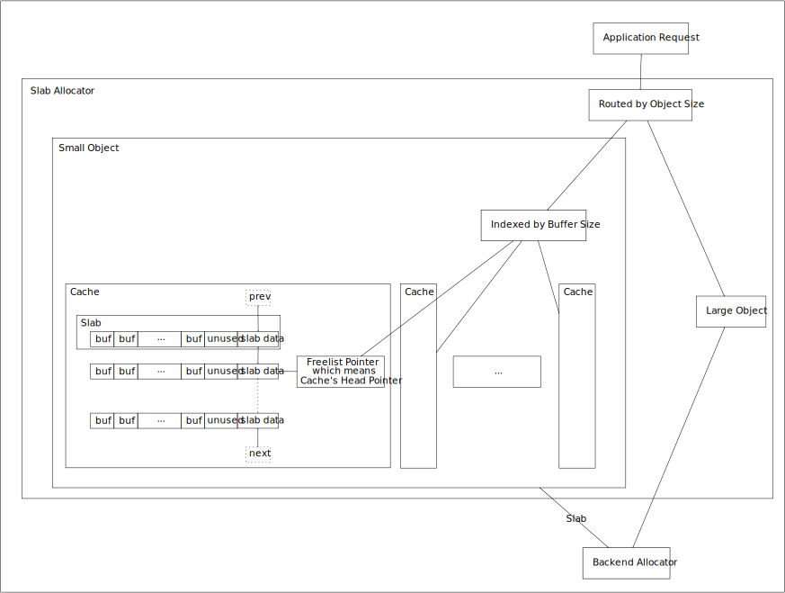

## License  
```  
Copyright (C) YuqiaoZhang(HanetakaYuminaga)

This program is free software: you can redistribute it and/or modify it under the terms of the GNU Lesser General Public License as published by the Free Software Foundation, either version 3 of the License, or (at your option) any later version.

This program is distributed in the hope that it will be useful, but WITHOUT ANY WARRANTY; without even the implied warranty of MERCHANTABILITY or FITNESS FOR A PARTICULAR PURPOSE.  See the GNU Lesser General Public License for more details.

You should have received a copy of the GNU Lesser General Public License along with this program.  If not, see <https://www.gnu.org/licenses/>
```  

## Slab Allocator

    

## McRT-Malloc  
   
McRT-Malloc is Segregated-Storage(\[Bonwick 1994\])   
   
McRT-Malloc | Slab Allocator   
:-: | :-:   
Bin | Cache  
Block | Slab  
Object | Buffer  

## VulkanMemoryAllocator

[VulkanMemoryAllocator](https://github.com/GPUOpen-LibrariesAndSDKs/VulkanMemoryAllocator)

## Gfx-Malloc of PatriotEngine   

The gfx-malloc requests are separated into several categories (6\.\[Microsoft\]).         

Usage Type | Typical Example
:-: | :-: 
TRANSFER_SRC_BUFFER | staging buffer   
UNIFORM_BUFFER | MVP matrices \/ Animation Bone matrices   
VERTEX_BUFFER | vertices of mesh assets  
INDEX_BUFFER | indices of mesh assets  
COLOR_ATTACHMENT_AND_INPUT_ATTACHMENT_AND_TRANSIENT_ATTACHMENT | G-Buffer   
COLOR_ATTACHMENT_AND_SAMPLED_IMAGE | write depth to color attachment as the apple Metal sample does   
DEPTH_STENCIL_ATTACHMENT | "DENY_SAMPLED_IMAGE" to improve performance  
SAMPLED_IMAGE | texture assets

* UNIFORM_BUFFER    
The gfx-malloc allocates a large block of memory directly from the Vulkan driver as the NVIDIA D3D11 Driver does (3\.\[Gruen 2015\] 4\.\[Microsoft\] 5\.\[Microsoft\]).    
    
* TRANSFER_SRC_BUFFER  
The gfx-malloc allocates directly from the Vulkan driver as the UNIFORM_BUFFER.

* COLOR_ATTACHMENT_AND_INPUT_ATTACHMENT_AND_TRANSIENT_ATTACHMENT    
COLOR_ATTACHMENT_AND_SAMPLED_IMAGE    
DEPTH_STENCIL_ATTACHMENT     
The gfx-malloc prefers the dedicated memory(VK_KHR_dedicated_allocation / D3D12_HEAP_FLAG_ALLOW_DISPLAY) and falls back to allocate directly from the Vulkan driver.     
   
* SAMPLED_IMAGE  
The gfx-malloc allocates images for assets by the slab allocator.   
   
* VERTEX_BUFFER    
INDEX_BUFFER   
The gfx-malloc allocates buffers for assets by the slab allocator as the SAMPLED_IMAGE.


## Reference
1\.\[Bonwick 1994\] [Jeff Bonwick. "The Slab Allocator: An Object-Caching Kernel Memory Allocator." USENIX 1994](https://www.usenix.org/legacy/publications/library/proceedings/bos94/bonwick.html)     
    
2\.\[Gorman 2004\] [Mel Gorman. "Understanding The Linux Virtual Memory Manager." Prentice Hall 2004.](https://www.kernel.org/doc/gorman/html/understand)    
    
3\.\[Gruen 2015\] [Holger Gruen. "Constant Buffers without Constant Pain." NVIDIA GameWorks Blog 2015.](https://developer.nvidia.com/content/constant-buffers-without-constant-pain-0)    
    
4\.\[Microsoft\] [Microsoft. "Ring buffer scenario." Microsoft Docs.](https://docs.microsoft.com/en-us/windows/win32/direct3d12/fence-based-resource-management#ring-buffer-scenario)    
    
5\.\[Microsoft\] [Microsoft. "Resource allocation state." DirectX-Specs.](https://microsoft.github.io/DirectX-Specs/d3d/CPUEfficiency.html#resource-allocation-state)    
         
6\.\[Microsoft\] [Microsoft. "Memory Management Strategies" Microsoft Docs.](https://docs.microsoft.com/en-us/windows/win32/direct3d12/memory-management-strategies)        
